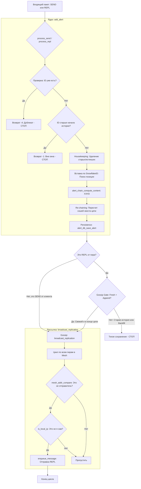

### Это описание и блок-схема отражают архитектуру системы после внесенных правок, которые устранили петли репликации и обеспечили консистентность хэш-цепочек.

#### 1. Описание логики работы механизма

Система представляет собой распределенный реестр зашифрованных сообщений, где порядок определяется **SnowflakeID**, а целостность — **XXH3 хэш-цепочкой**.

1.  **SnowflakeID (Временная детерминированность):** Каждый алерт имеет 64-битный ID, содержащий метку времени. Это позволяет нодам однозначно определять место алерта в истории (индекс в массиве) без центрального координатора.
2.  **XXH3 Chaining (Blockchain-целостность):**
    *   Каждый блок содержит `prev_hash` (хэш предыдущего по порядку ID алерта).
    *   При вставке в середину (BACKFILL) функция `add_alert` рекурсивно пересчитывает хэши всех последующих блоков.
    *   Это гарантирует, что если у двух нод совпадает `last_hash`, то вся их история идентична.
3.  **Gossip Gate (Предотвращение шторма):**
    *   Активная рассылка (`REPL`) разрешена только для "головы" цепи.
    *   Если прилетает старая история (BACKFILL), нода сохраняет её, пересчитывает хэши, но "молчит" (не делает broadcast). Это разрывает петлю репликации.
4.  **NAT/Reflection Protection:** Благодаря L2-уровню (`admin_mesh`), сервер понимает, что разные IP-адреса (внешний IP и IP шлюза Docker) могут принадлежать одному и тому же узлу, и не шлет ему его же данные обратно.

---

#### 2. Блок-схема механизма репликации

#### Детализация функций на схеме:
*   **`add_alert`**: Главный контроллер целостности. Гарантирует, что данные уникальны и вписаны в цепочку.
*   **`clean_expired_alerts_logic` / `remove_oldest_alert`**: Управление размером буфера (LRU-подобная логика по SnowflakeID).
*   **`Re-chaining`**: Процесс обновления `prev_hash` и `curr_hash` для всех элементов массива после точки вставки. Именно этот процесс делает базу данных "цепочкой блоков".
*   **`broadcast_replication`**: Интеллектуальный роутер. Использует данные из `MeshNode`, чтобы не допустить "эха" сообщения в сетях со сложной топологией (Docker/NAT).
*   **`Gossip Gate`**: Логический фильтр внутри `process_repl`, который отличает синхронизацию истории (нужно молчать) от получения нового события в реальном времени (нужно кричать всем).
