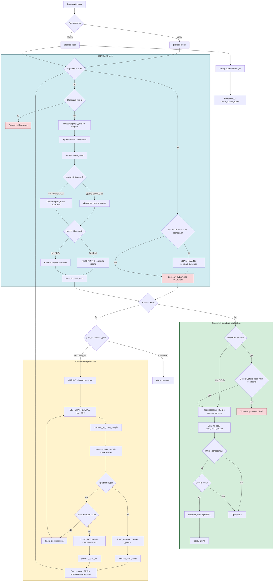

Это описание и блок-схема отражают архитектуру системы после внесенных правок, которые устранили петли репликации и обеспечили консистентность хэш-цепочек.

### 1. Короткое описание изменений для коммита
**Subject:** `Fix replication storms and ensure P2P consistency`

**Body:**
- Перенес проверку дубликатов в `add_alert` до начала очистки старых записей.
- Внедрил «ID Window Check»: игнорирование алертов старше текущей истории ноды.
- Ограничил Gossip (REPL) только для свежих (age < 120s) алертов, добавленных в конец цепи (APPEND).
- Усилил защиту от зацикливания в `broadcast_replication`, используя L2-метаданные (`sender_node`) и `mesh_addr_compare` для дедупликации путей в NAT/Docker.
- Унифицировал передачу статуса `is_active` через `add_alert`.

---

### 2. Описание логики работы механизма

Система представляет собой распределенный реестр зашифрованных сообщений, где порядок определяется **SnowflakeID**, а целостность - **XXH3 хэш-цепочкой** с механизмом **самоисцеления (Chain Healing)**.

1.  **SnowflakeID (Временная детерминированность):** Каждый алерт имеет 64-битный ID, содержащий метку времени. Это позволяет нодам однозначно определять место алерта в истории без центрального координатора. Дополнительно работает **умное вытеснение**: если приходящий алерт имеет ID меньше минимального ID в памяти (т.е. уже выпал из окна хранения), он отбрасывается (`return -1`) - это предотвращает циклическую перезапись базы при backfill.

2.  **XXH3 Chaining (Blockchain-целостность с условным re-chaining):**
    *   Каждый блок содержит `prev_hash` (хэш предыдущего по порядку ID алерта) и `curr_hash` (свой собственный).
    *   **Ключевое изменение:** re-chaining (пересчёт хешей хвоста цепи) теперь **условный** - он запускается **только для локальных вставок** (`SEND` от клиента, `forced_id == 0`). При репликации (`REPL` от пира) пересчёт пропущен, что защищает от массового пересчёта тысяч хешей во время `SYNC_REC` и от поломки уже согласованной цепочки.
    *   При репликации нода **доверяет хешам источника**: `prev_hash` и `curr_hash` принимаются от пира как истина, что позволяет корректно встраивать алерты даже при наличии временных дыр в локальной истории.
    *   Это гарантирует, что если у двух нод совпадает `last_hash`, то вся их история идентична.

3.  **Chain Healing Protocol (Самоисцеление разрывов):**
    *   Протокол `REPL` расширен до 12 полей: теперь передаются эталонные `prev_hash` и `curr_hash` от источника.
    *   Если при репликации обнаруживается **дубликат с расходящимися хешами** (локальная цепочка была повреждена ранее), срабатывает **Chain Healing**: нода перезаписывает испорченные хеши на корректные значения от пира, разрывая петлю P2P-шторма.
    *   Если же алерт новый, но его `prev_hash` не совпадает с локальным (реальный пробел в истории), нода инициирует **лечение через сэмплы**: `GET_CHAIN_SAMPLE → CHAIN_SAMPLE → SYNC_RANGE` (дельта) или `SYNC_REC` (полная синхронизация при глубоком расхождении).

4.  **Gossip Gate (Двухуровневый фильтр распространения):**
    *   **Уровень 1 - Freshness & Append Gate:** активная рассылка (`broadcast_replication`) разрешена только для алертов, созданных менее 120 секунд назад **И** находящихся на "голове" цепи (`pos == count - 1`). Если прилетает старая история (BACKFILL), нода сохраняет её молча - это разрывает петлю репликации.
    *   **Уровень 2 - Divergence Trigger:** после обработки `REPL` нода сравнивает `a->prev_hash` с `remote_prev_hash`. При несовпадении (и только если Chain Healing не смог исправить ситуацию) инициируется `GET_CHAIN_SAMPLE`. Благодаря Chain Healing этот триггер срабатывает **только при реальном пробеле**, а не на дубликатах.

5.  **NAT/Reflection Protection:** Благодаря L2-уровню (`admin_mesh`), сервер понимает, что разные IP-адреса (внешний IP и IP шлюза Docker) могут принадлежать одному и тому же узлу. Функции `mesh_addr_compare` и `is_local_ip` гарантируют, что нода не шлёт алерт обратно источнику или самой себе, предотвращая "эхо" в сложных топологиях.

6.  **Замер метрик L2:** Каждый успешный приём `REPL` сопровождается замером времени обработки (`gettimeofday`), что позволяет вычислять реальную скорость приёма данных пира (`mesh_update_speed`) и использовать её в формуле `gorgona_score` для выбора оптимального соседа.

---

### 3. Блок-схема механизма репликации

---

### Детализация функций на схеме:

#### 1. **`add_alert`** - Контроллер целостности + механизм Chain Healing

> **Было:** «Главный контроллер целостности. Гарантирует, что данные уникальны и вписаны в цепочку.»
>
> **Стало:** «Главный контроллер целостности с **двумя режимами работы**:
> - **Локальная вставка (SEND):** генерирует SnowflakeID, считает `prev_hash`/`curr_hash` локально, запускает re-chaining хвоста.
> - **Репликация (REPL):** принимает `remote_prev_hash`/`remote_curr_hash` от пира как **истину**, предотвращая corruption при наличии дыр в истории.
> - **Chain Healing:** если алерт уже существует, но его локальные хеши расходятся с присланными - **перезаписывает** их, разрывая петлю P2P-шторма.»

---

#### 2. **`clean_expired_alerts_logic` / `remove_oldest_alert`** - Детерминированный Housekeeping

> **Было:** «Управление размером буфера (LRU-подобная логика по SnowflakeID).»
>
> **Стало:** «**Детерминированная очистка** по логическому времени кластера (Pulse), а не по системному `time()`.
> - `clean_expired_alerts_logic`: удаляет неактивные (отозванные) и истёкшие по TTL алерты.
> - `remove_oldest_alert`: вытесняет алерт с **минимальным SnowflakeID** (не LRU, а хронологическое FIFO).
> - **Smart Vacuum Trigger**: перезапись диска только при накоплении `waste_count ≥ threshold` И `≥ 100` записей - защита от частых I/O на маленьких базах.
> - **Умное вытеснение (FIX 2):** если приходящий алерт старше минимального ID в памяти - он отбрасывается (`return -1`), что предотвращает циклическую перезапись окна хранения.»

---

#### 3. **`Re-chaining`** - Условный пересчёт хвоста цепи

> **Было:** «Процесс обновления `prev_hash` и `curr_hash` для всех элементов массива после точки вставки. Именно этот процесс делает базу данных "цепочкой блоков".»
>
> **Стало:** «**Условный** процесс пересчёта хвоста цепи, **запущенный только для локальных вставок** (`forced_id == 0`).
> - Для `SEND` от клиента: пересчитывает все последующие `prev_hash`/`curr_hash` - это и есть "цепочка блоков".
> - Для `REPL` от пира: **пропущен полностью**. Это критическая защита от массового пересчёта тысяч хешей при `SYNC_REC` и от поломки уже согласованной цепочки при backfill.
> - Именно отключение re-chaining для репликации **снижает загрузку CPU** с 100% до нормы во время синхронизации.»

---

#### 4. **`broadcast_replication`** - Интеллектуальный роутер с расширенным протоколом

> **Было:** «Интеллектуальный роутер. Использует данные из `MeshNode`, чтобы не допустить "эха" сообщения в сетях со сложной топологией (Docker/NAT).»
>
> **Стало:** «Интеллектуальный роутер с **двумя уровнями защиты от петель**:
> - **Топологический:** через `mesh_addr_compare` и `is_local_ip` не отправляет алерт обратно источнику или самому себе (защита от Docker/NAT-эха).
> - **Протокольный:** передаёт **12 полей** в `REPL` (добавлены `prev_hash` и `curr_hash`), что позволяет принимающей ноде верифицировать цепочку без локального пересчёта.
> - Вызывается как из `process_send` (всегда), так и из `process_repl` (только при `is_fresh && is_append`).»

---

#### 5. **`Gossip Gate`** - Фильтр распространения + триггер лечения

> **Было:** «Логический фильтр внутри `process_repl`, который отличает синхронизацию истории (нужно молчать) от получения нового события в реальном времени (нужно кричать всем).»
>
> **Стало:** «Двухуровневый фильтр в `process_repl`:
> - **Уровень 1 - Gossip Gate:** `is_fresh (create_at < 120s) && is_append (pos == count-1)`. Если условие ложно (backfill истории) - алерт сохраняется молча, без широковещательной рассылки.
> - **Уровень 2 - Chain Healing Trigger:** если `a->prev_hash != remote_prev_hash` - инициирует `GET_CHAIN_SAMPLE` для лечения разрыва. После применения Chain Healing в `add_alert` это условие срабатывает **только при реальном пробеле**, а не при дубликатах, что разрывает петлю шторма.
> - Дополнительно: замер скорости через `mesh_update_speed` (start_tv/end_tv) для L2-метрик.»

---

### 📋 Итоговая таблица соответствия

| Функция | Ключевое изменение после патчей |
|---|---|
| `add_alert` | Добавлен режим Chain Healing + условная логика хешей |
| `clean_expired_alerts_logic` | Работает по Pulse-времени, не по системному |
| `remove_oldest_alert` | Smart Vacuum + защита от циклической перезаписи |
| **Re-chaining** | **Условный**: только для `forced_id == 0` |
| `broadcast_replication` | Новый формат `REPL` (12 полей) |
| **Gossip Gate** | Добавлен триггер `GET_CHAIN_SAMPLE` при расхождении хешей |

