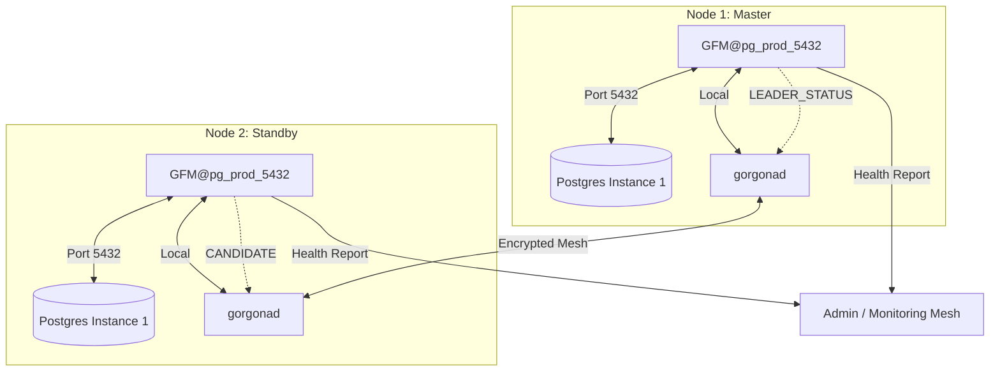

### GFM: Gorgona Failover Manager for PostgreSQL

**GFM** is a decentralized, high-availability (HA) management daemon for PostgreSQL. It utilizes the **Gorgona P2P Mesh Network** as an encrypted, serverless control plane to provide leader election, split-brain protection, and automated self-healing.

Unlike traditional HA solutions (Patroni, Stolon), GFM does not require a centralized consensus store (like etcd, Consul, or ZooKeeper), making it perfect for distributed edge computing, multi-region clusters, and high-security environments.

---

### Core Features

- **Multi-Instance Isolation:** Run multiple independent GFM clusters on the same physical hardware using unique `cluster_id`s, separate database ports, and Systemd templates.
- **P2P Orchestration:** Fully decentralized signaling via Gorgona Mesh—no single point of failure.
- **LSN-Based Consensus:** Mathematical leader election based on the most advanced PostgreSQL Log Sequence Number (LSN).
- **Deterministic Tie-Breaking:** In case of identical LSNs, alphabetical hostname priority ensures a single, stable leader.
- **Safe DB Monitoring:** Protects your database from monitoring overhead using unique per-cluster lock files (`fcntl.flock`) and strict execution timeouts.
- **Patroni-style Self-Healing:** Failed nodes automatically rejoin as Standby via `pg_rewind` (saving bandwidth) or `pg_basebackup`.
- **Dual-Key Security:** Separate keys for cluster control and administrative reporting (`admin_pub_hash`).

---

### Deployment & Installation

GFM features a professional installer that automates cluster provisioning based on a single configuration file.

#### 1. Prepare the Inventory (`nodes.list`)
Define your nodes in a local `nodes.list` file:
```text
# IP Address      Role (Use 'witness' for arbiter, leave empty for DB nodes)
192.168.1.170
192.168.1.171
192.168.1.172    witness
```

#### 2. Run the Installer
Launch the installer by pointing it to your cluster configuration:
```bash
chmod +x install.sh
./install.sh ./gfm.conf
```
*The installer automatically creates the Postgres instance (via `pg_createcluster`), configures `/etc/hosts`, and starts the `gfm@pg_prod_5432` service.*

---

### Configuration (`gfm.conf`)

Each instance is managed by its own config file (e.g., `/etc/gorgona/gfm_pg_prod_5432.conf`).

| Section | Parameter | Description |
| :--- | :--- | :--- |
| **[cluster]** | `cluster_id` | Unique ID (e.g., `pg_prod_5432`). Isolates logs and status. |
| | `my_pub_hash` | The P2P hash for the encrypted cluster control channel. |
| **[postgresql]** | `service_name` | The Systemd service name (e.g., `postgresql@17-prod`). |
| | `pg_instance_name`| Instance name for `pg_ctlcluster` (e.g., `prod`). |
| | `port` | Database port (e.g., `5433`). |

---

### Post-Installation Checklist (Critical for Multi-Instance)

When running multiple clusters on the same nodes, ensure each PostgreSQL instance is manually configured for network replication:

#### 1. Create Replication User (On each Master)
Each instance is a separate DB environment. You **must** create the user for each port:
```bash
# For Cluster 1 (5432)
psql -p 5432 -c "CREATE USER repuser WITH REPLICATION PASSWORD 'your_secure_password';"
# For Cluster 2 (5433)
psql -p 5433 -c "CREATE USER repuser WITH REPLICATION PASSWORD 'your_secure_password';"
```

#### 2. Configure Authentication (`.pgpass`)
The `gfm_rebuild.sh` script uses a shared `.pgpass` file. Ensure it contains entries for all used ports:
```bash
# cat /var/lib/postgresql/.pgpass
*:5432:*:repuser:your_secure_password
*:5433:*:repuser:your_secure_password
```
*Note: Permissions must be `0600` and owner `postgres`.*

#### 3. Enable Network & Replication (`postgresql.conf`)
Each instance has its own config file (e.g., `/etc/postgresql/17/prod2/postgresql.conf`).
```ini
listen_addresses = '*'       # Required to accept remote replication
wal_level = replica          # Required for standby nodes
wal_log_hints = on           # Required for pg_rewind self-healing
max_wal_senders = 10
max_replication_slots = 10
```

#### 4. Allow Access (`pg_hba.conf`)
Modify `pg_hba.conf` for **each** instance to allow your cluster subnet:
```text
host    replication     repuser         192.168.1.0/24          scram-sha-256
host    postgres        repuser         192.168.1.0/24          scram-sha-256
```
*After changes, always restart the specific instance:* `systemctl restart postgresql@17-prod2`

---

### Architecture & Failover Logic

#### 1. Template-Based Orchestration
GFM uses Systemd template units (`gfm@.service`). This allows `gfm@prod1` and `gfm@prod2` to coexist on the same node. Each instance maintains its own status file: `/etc/gorgona/status_CLUSTER_ID.json` and a unique lock file in `/tmp/` to prevent monitoring collisions.

#### 2. Conflict Resolution (Fencing)
If two nodes claim to be Master, GFM resolves the conflict:
1. **Higher LSN wins.**
2. **If LSN is equal, the lower hostname wins.**
The losing node performs **Hard Fencing** (stops its Postgres service) and triggers an **Auto-Rebuild** to rejoin as a replica.

#### 3. Smart Rebuild
The `gfm_rebuild.sh` script automatically:
- Attempts `pg_rewind` first to synchronize data with minimal traffic.
- Falls back to `pg_basebackup` with automated replication slot creation.
- **Multi-port aware:** Dynamically configures `primary_conninfo` with the correct port for the specific cluster.

---

### Cluster Workflow Diagram



---

### Operational Commands

| Command | Action |
| :--- | :--- |
| `gfm_health <conf>` | Detailed report: Role, LSN, Replication Lag (bytes & time). |
| `gfm_status <conf>` | Returns raw JSON cluster state. |
| `gfm_switchover <conf>` | Graceful role reversal: Master steps down. |
| `gfm_control <conf> <act>`| Service control: `start`, `stop`, `promote`. |

---

### Logs & Troubleshooting

- **GFM Daemon Logs:** `journalctl -u gfm@CLUSTER_ID -f`
- **Rebuild History:** `/var/log/gorgona/rebuild_CLUSTER_ID.log`
- **Postgres Logs:** `journalctl -u postgresql@VERSION-INSTANCE -f`
- **Network Check:** `nc -zv <MASTER_IP> <PORT>` (Verify if Master is listening).
    
### Uninstall / Cleanup
```bash
chmod +x uninstall.sh
```
#### To delete everything including Postgres data:
```bash
./uninstall.sh ./gfm.conf
```

#### To remove GFM but keep the Postgres data (services will be stopped):
```bash
./uninstall.sh ./gfm.conf --exclude-db
```
The uninstaller stops the gfm@CLUSTER_ID service and removes instance-specific configurations. By default, it also drops the PostgreSQL cluster instance. 
Using --exclude-db will preserve your database files while only stopping the services.
