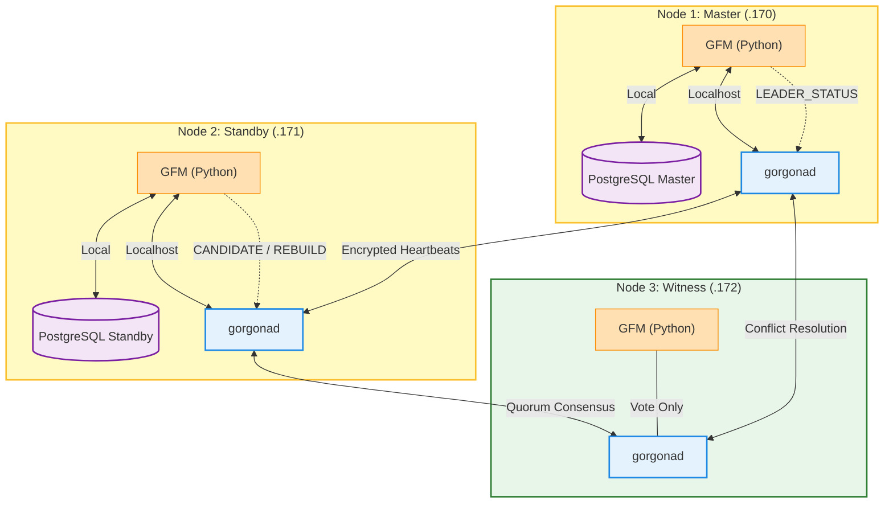

### GFM: Gorgona Failover Manager for PostgreSQL

**GFM** is a distributed, high-availability (HA) management daemon for PostgreSQL. It leverages the **Gorgona P2P Mesh Network** as its control plane, providing encrypted signaling, decentralized leader election, and automated self-healing without the need for centralized consensus stores like etcd or Consul.

#### Architecture Overview

GFM operates as an intelligent agent (`gfm.py`) running on every database node and witness node. It communicates with the local `gorgonad` daemon via encrypted channels to propagate cluster state and resolve conflicts.

#### Key Components
- **Command Plane (Layer 1):** Uses Gorgona's E2E encryption to broadcast `LEADER_STATUS`, `CANDIDATE` votes, and `MONITOR` telemetry.
- **LSN-Based Consensus:** In the event of a conflict, the node with the most advanced Log Sequence Number (LSN) is mathematically prioritized.
- **Deterministic Tie-Breaking:** If LSNs are identical, alphabetical hostname priority ensures a single leader emerges.
- **Witness Node (Arbitrator):** A lightweight node that participates in quorum voting but does not host a database, preventing "Split-Brain" in 2-node clusters.
- **Automated Self-Healing:** Integrated Patroni-style recovery using `pg_rewind` and `pg_basebackup` to automatically re-attach failed nodes as replicas.

---

### How It Works

#### 1. State Synchronization
Every 5 seconds, GFM probes the local PostgreSQL instance using `pg_is_in_recovery()`. 
- If the DB is Read-Write, the node assumes the **LEADER** role.
- If the DB is in Recovery, it assumes the **STANDBY** role.
- If no Postgres is found, it operates in **WITNESS** mode.

#### 2. Heartbeat & Monitoring
The Leader broadcasts a `LEADER_STATUS` packet into the mesh every 10-20 seconds. This packet contains the node's name and current LSN. Standby nodes monitor these pulses. If no pulse is received within the `ELECTION_TIMEOUT` (default 70s), an election is triggered.

#### 3. Conflict Resolution (Split-Brain Protection)
If two nodes claim to be LEADER:
1. They compare LSNs: The node with the higher LSN remains Leader.
2. If LSNs are equal: The node with the "smaller" name alphabetically (e.g., `node1` < `node2`) remains Leader.
3. The losing node performs **Hard Fencing**: It immediately stops its local PostgreSQL service to prevent data corruption.

### 4. Automated Recovery
When a failed node returns, GFM detects it is a Standby with a broken replication link or an empty database. It automatically identifies the current Leader and triggers the `gfm_rebuild.sh` script to perform an incremental `pg_rewind` or a full `pg_basebackup`.

---

## Cluster Workflow Diagram

---

### Operational Commands

GFM allows remote administration through the Gorgona mesh using the `exec_commands` section in `gorgona.conf`.

| Command | Action |
| :--- | :--- |
| `gfm_health` | Generates a complex report including `pg_stat_wal_receiver` status. |
| `gfm_switchover` | Gracefully stops the current Master and forces a failover. |
| `gfm_rebuild` | Manually triggers `pg_rewind` or `pg_basebackup` on a node. |

## Failover Logic Flow
1. **Detection:** Master goes offline $\rightarrow$ Standby stops receiving pulses.
2. **Quorum Check:** Standby checks if it can see the Witness node $\rightarrow$ Verified.
3. **Candidacy:** Standby broadcasts `CANDIDATE` message with its LSN.
4. **Election:** If no other node has a higher LSN after 10s $\rightarrow$ Win.
5. **Promotion:** Standby executes `pg_ctl promote` $\rightarrow$ Becomes the new Master.
6. **Persistence:** New Master starts broadcasting `LEADER_STATUS`.
7. **Rejoin:** Old Master recovers $\rightarrow$ Sees new Leader $\rightarrow$ Performs `auto_rebuild` $\rightarrow$ Joins as Standby.
