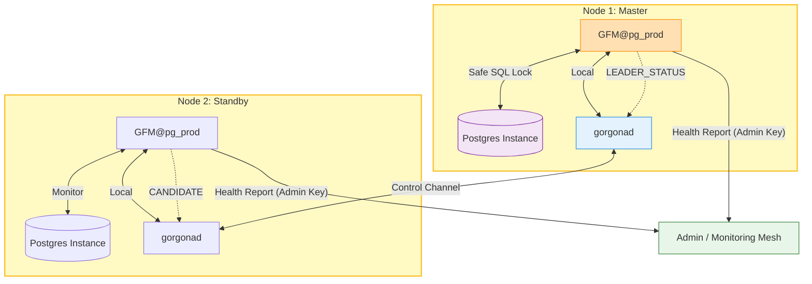

### GFM: Gorgona Failover Manager for PostgreSQL

**GFM** is a decentralized, high-availability (HA) management daemon for PostgreSQL. It utilizes the **Gorgona P2P Mesh Network** as an encrypted, serverless control plane to provide leader election, split-brain protection, and automated self-healing.

Unlike traditional HA solutions (Patroni, Stolon), GFM does not require a centralized consensus store (like etcd, Consul, or ZooKeeper), making it perfect for distributed edge computing, multi-region clusters, and high-security environments.

---

### Core Features

- **Multi-Instance Isolation:** Run multiple independent GFM clusters on the same physical hardware using unique `cluster_id`s and Systemd templates.
- **P2P Orchestration:** Fully decentralized signaling via Gorgona Mesh—no single point of failure.
- **LSN-Based Consensus:** Mathematical leader election based on the most advanced PostgreSQL Log Sequence Number (LSN).
- **Deterministic Tie-Breaking:** In case of identical LSNs, alphabetical hostname priority ensures a single, stable leader.
- **Safe DB Monitoring:** Protects your database from monitoring overhead using file-level locking (`fcntl.flock`) and strict execution timeouts.
- **Patroni-style Self-Healing:** Failed nodes automatically rejoin as Standby via `pg_rewind` (saving bandwidth) or `pg_basebackup`.
- **Dual-Key Security:** Separate keys for cluster control and administrative reporting (`admin_pub_hash`).
- **Audit & History:** Critical events (promotions, fencing, rebuilds) are persisted in the mesh history for 24h+.

---

### Deployment & Installation

GFM features a professional installer that automates cluster provisioning based on a single configuration file.

#### 1. Prepare the Inventory (`nodes.list`)
Define your nodes in a local `nodes.list` file:
```text
# IP Address      Role (Use 'witness' for arbiter, leave empty for DB nodes)
192.168.1.170
192.168.1.171
192.168.1.172    witness
```

#### 2. Run the Installer
Launch the installer by pointing it to your cluster configuration:
```bash
chmod +x install.sh
./install.sh ./gfm.conf
```
*The installer automatically creates the Postgres instance (via `pg_createcluster`), configures `/etc/hosts`, and starts the `gfm@pg_prod_5432` service.*

#### 3. Uninstall / Cleanup
To remove a specific instance from the cluster:
```bash
./uninstall.sh ./gfm.conf
```

---

### Configuration (`gfm.conf`)

Each instance is managed by its own config file (e.g., `/etc/gorgona/gfm_pg_prod.conf`).

| Section | Parameter | Description |
| :--- | :--- | :--- |
| **[cluster]** | `cluster_id` | Unique ID for the instance (isolates logs, status, and services). |
| | `my_pub_hash` | The P2P hash for the encrypted cluster control channel. |
| | `admin_pub_hash` | The P2P hash for administrative health reports. |
| **[postgresql]** | `service_name` | The Systemd service name (e.g., `postgresql@17-main`). |
| | `pg_version` | PostgreSQL version (e.g., `17`). |
| | `port` | Database port (e.g., `5432`). |
| **[timings]** | `heartbeat_interval`| Frequency of the Leader pulse (seconds). |
| | `election_timeout` | Calculated automatically ($interval \times missed + 5s$). |

---

### Architecture & Failover Logic

#### 1. Template-Based Orchestration
GFM uses Systemd template units (`gfm@.service`). This allows `gfm@prod` and `gfm@dev` to coexist on the same node without interference. Each instance maintains its own status file: `/etc/gorgona/status_CLUSTER_ID.json`.

#### 2. Conflict Resolution (Fencing)
If two nodes claim to be Master, GFM resolves the conflict:
1. **Higher LSN wins.**
2. **If LSN is equal, the lower hostname wins.**
The losing node performs **Hard Fencing** (stops its Postgres service immediately) and triggers an **Auto-Rebuild** to rejoin as a replica.

#### 3. Smart Rebuild
The `gfm_rebuild.sh` script automatically:
- Attempts `pg_rewind` first to synchronize data with minimal traffic.
- Falls back to `pg_basebackup` with automated replication slot creation if the timelines have diverged too much.

---

### Cluster Workflow Diagram



---

### Operational Commands

Remote administration is executed via the Gorgona mesh using the specific instance configuration.

| Command | Action |
| :--- | :--- |
| `gfm_health <conf>` | Detailed report: Role, LSN, Replication Lag (bytes & time). |
| `gfm_status <conf>` | Returns raw JSON cluster state. |
| `gfm_switchover <conf>` | Graceful role reversal: Master steps down to become Standby. |
| `gfm_rebuild <conf>` | Manually triggers `pg_rewind` or `pg_basebackup`. |
| `gfm_control <conf> <act>`| Service control: `start`, `stop`, `promote`, `restart_gfm`. |

**Example: Check Health of a Specific Cluster**
```bash
gorgona send "$(date -u '+%Y-%m-%d %H:%M:%S')" "$(date -u -d '+30 min' '+%Y-%m-%d %H:%M:%S')" \
"gfm_cluster_health" "admin_key.pub"
```

---

### Logs & Troubleshooting

- **GFM Daemon Logs:** `journalctl -u gfm@CLUSTER_ID -f`
- **Rebuild History:** `/var/log/gorgona/rebuild_CLUSTER_ID.log`
- **Health History:** `/var/log/gorgona/health_CLUSTER_ID.log`
- **Local State File:** `cat /etc/gorgona/status_CLUSTER_ID.json`
