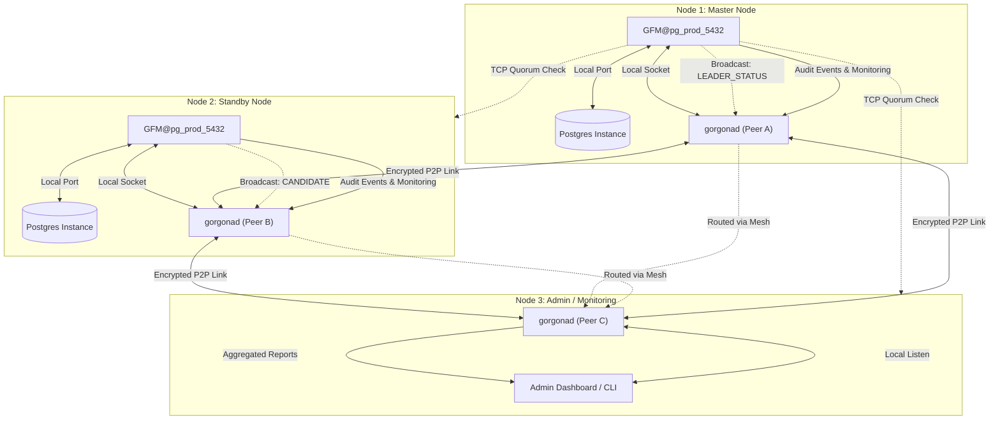

### GFM: Gorgona Failover Manager for PostgreSQL

**GFM** is a decentralized, high-availability (HA) management daemon for PostgreSQL. It utilizes the **Gorgona P2P Mesh Network** as an encrypted, serverless control plane to provide leader election, split-brain protection, and automated self-healing.

Unlike traditional HA solutions (Patroni, Stolon), GFM does not require a centralized consensus store (like etcd, Consul, or ZooKeeper), making it perfect for distributed edge computing, multi-region clusters, and high-security environments.

---

### Core Features

- **P2P Orchestration:** Fully decentralized signaling via Gorgona Mesh—no single point of failure.
- **TCP Quorum Fencing:** Advanced split-brain protection. The Leader automatically stops the database service ("suicide") if it loses connection to the majority of nodes.
- **Auto Witness Detection:** Infrastructure roles are determined dynamically. If a node's port in the quorum list differs from the PostgreSQL port, GFM treats it as an Arbitrator (Witness).
- **Multi-Instance Isolation:** Run multiple independent GFM clusters on the same physical hardware using unique `cluster_id`s and Systemd templates.
- **LSN-Based Consensus:** Mathematical leader election based on the most advanced PostgreSQL Log Sequence Number (LSN).
- **Deterministic Tie-Breaking:** In case of identical LSNs, alphabetical hostname priority ensures a single, stable leader.
- **Safe DB Monitoring:** Protects your database from monitoring overhead using unique per-cluster lock files (`fcntl.flock`) and strict execution timeouts.

---

### Configuration (`gfm.conf`)

The configuration file is the **Single Source of Truth**. No external inventory files (like `nodes.list`) are required. The installer and the daemon both parse this file to understand the cluster topology.

```ini
[cluster]
# P2P Mesh hash for cluster control and leader election
my_pub_hash = +I9IQuXYW8I=
# Public hash of the administrator or monitoring system to receive health reports
admin_pub_hash = zpPVK9fbEqo=
# Total number of nodes in the cluster (used to calculate majority quorum)
quorum_total_nodes = 3
# Unique cluster identifier used for log isolation and status file naming
cluster_id = pg_prod_5432 
# List of cluster members in IP:PORT format (comma-separated)
# If PORT does not match the PostgreSQL port, the node is treated as a WITNESS.
quorum_nodes = 192.168.1.170:5432, 192.168.1.171:5432, 192.168.1.172:7777

[postgresql]
# Systemd service name (e.g., postgresql@17-main)
service_name = postgresql@17-main
# PostgreSQL version and instance name for pg_ctlcluster commands
pg_version = 17
pg_instance_name = main
# Database port used for health checks and psql connections
port = 5432

[timings]
# Frequency (in seconds) of leader heartbeat broadcasts
heartbeat_interval = 15
# Maximum number of missed heartbeats before a leader is considered failed
max_missing_heartbeats = 3
# Frequency (in seconds) of sending MONITOR telemetry to the admin mesh
monitor_interval = 300
# TTL (Time To Live) in seconds for heartbeat messages in the mesh
heartbeat_ttl = 45
# TTL (Time To Live) in seconds for important audit events (EVENT|...)
event_ttl = 86400
# Default TTL for standard mesh messages
default_ttl = 3600

[paths]
# Base directory for configuration and key storage
base_dir = /etc/gorgona
# Path to the Gorgona mesh binary
gorgona_bin = /usr/bin/gorgona
# Path to the psql utility
psql_bin = /usr/bin/psql
# Path to the pg_ctlcluster wrapper (standard for Debian/Ubuntu)
pg_ctl_bin = /usr/bin/pg_ctlcluster
# Path to the automated database recovery/rebuild script
rebuild_script = /usr/local/bin/gfm_rebuild.sh
```

---

### Quorum & Split-Brain Protection

GFM implements strict **Network Quorum** logic to ensure data integrity:

1. **Election Quorum:** A node cannot initiate an election or promote itself to `CANDIDATE` status unless it can reach at least `(N/2)+1` nodes from the `quorum_nodes` list via TCP.
2. **Leader Fencing:** The active Leader checks the availability of its peers in every cycle (5 seconds). If the Leader becomes isolated (loses quorum), it immediately triggers a `demote` action—stopping the PostgreSQL service to prevent "split-brain" writes.
3. **Witness (Arbitrator):** A Witness node does not host a database but provides a vital "vote" to reach a majority. GFM verifies the Witness via the specified port (Gorgonad port).

---

### Cluster Workflow Diagram



---

### Deployment & Installation

The installer automates cluster provisioning across all nodes defined in the `quorum_nodes` list.

#### 1. Run the Installer
Launch the installer by pointing it to your configuration file:
```bash
chmod +x install.sh
./install.sh ./gfm_prod_5432.conf
```
*The installer creates the Postgres instance (via `pg_createcluster`), configures `/etc/hosts` for local resolution, and starts the `gfm@pg_prod_5432` template service.*

#### 2. Uninstallation
```bash
# To delete everything including Postgres data:
./uninstall.sh ./gfm.conf

# To remove GFM but keep the Postgres data (services will be stopped):
./uninstall.sh ./gfm.conf --exclude-db
```

---

### Post-Installation Checklist

Since GFM manages the failover orchestration, you must ensure PostgreSQL is manually configured for network replication:

1. **Create Replication User (On each Master node):**
   ```sql
   CREATE USER repuser WITH REPLICATION PASSWORD 'your_secure_password';
   ```
   `REPLICATION` alone is enough for `pg_basebackup`, but `pg_rewind` connects as
   the same user and additionally needs to read files on the source node. Without
   these grants every `pg_rewind` fails with
   `permission denied for function pg_read_binary_file` and `gfm_rebuild.sh`
   silently falls back to a full `pg_basebackup`:
   ```sql
   GRANT EXECUTE ON FUNCTION pg_catalog.pg_ls_dir(text, boolean, boolean) TO repuser;
   GRANT EXECUTE ON FUNCTION pg_catalog.pg_stat_file(text, boolean) TO repuser;
   GRANT EXECUTE ON FUNCTION pg_catalog.pg_read_binary_file(text) TO repuser;
   GRANT EXECUTE ON FUNCTION pg_catalog.pg_read_binary_file(text, bigint, bigint, boolean) TO repuser;
   ```
2. **Configure Authentication (`.pgpass`):**
   The `gfm_rebuild.sh` script requires a `.pgpass` file in the postgres home directory (chmod `0600`):
   ```text
   *:5432:*:repuser:your_secure_password
   ```
3. **Enable Replication (`postgresql.conf`):**
   Ensure `wal_level = replica` and `wal_log_hints = on` (required for `pg_rewind` self-healing).
4. **Allow Network Access (`pg_hba.conf`):**
   Allow your cluster subnet to connect for replication:
   ```text
   host replication repuser 192.168.1.0/24 scram-sha-256
   ```

---

### Architecture Logic

- **Smart Rebuild:** The `gfm_rebuild.sh` script automatically attempts `pg_rewind` first (to save bandwidth by rolling back diverged timelines) or falls back to `pg_basebackup` if the local database is empty or corrupted.
- **Conflict Resolution:** If two nodes claim leadership, the one with the higher LSN wins. If LSNs are equal, the node with the lower alphabetical hostname wins. The "loser" is automatically fenced (stopped) and rebuilt as a standby.
- **Decentralized Signaling:** All status updates (`LEADER_STATUS`) and election requests (`CANDIDATE`) are encrypted and broadcasted via the Gorgona P2P Mesh.

---

### Logs & Troubleshooting

- **GFM Daemon Logs:** `journalctl -u gfm@CLUSTER_ID -f`
- **Rebuild History:** `/var/log/gorgona/rebuild_CLUSTER_ID.log`
- **Postgres Logs:** `journalctl -u postgresql@VERSION-INSTANCE -f`
- **Real-time Status:** `cat /etc/gorgona/status_CLUSTER_ID.json` (Raw cluster state for UI or monitoring integrations).
    
### Failover and Resilience Testing

To verify the cluster's high-availability logic and split-brain prevention, you can simulate a network partition (isolation) on the Master node.

### 1. Simulating Master Node Isolation
Run the following command on the **Master node**. It blocks all traffic except SSH for 5 minutes, then automatically restores connectivity:

```bash
iptables -A INPUT -p tcp --dport 22 -j ACCEPT && \
iptables -A OUTPUT -p tcp --sport 22 -j ACCEPT && \
iptables -P INPUT DROP && \
iptables -P OUTPUT DROP && \
echo "Node isolated. Rollback in 300s" && \
sleep 300 && \
iptables -P INPUT ACCEPT && \
iptables -P OUTPUT ACCEPT && \
iptables -F && \
echo "Network restored"
```

### 2. Monitoring Cluster Status
While the test is running, monitor the real-time state of the cluster on any node:

```bash
# Replace 'pg_prod_5432' with your actual Cluster ID
watch -n 1 "cat /etc/gorgona/status_pg_prod_5432.json"
```

### Expected Behavior
1. **Master Node**: Within seconds of isolation, the GFM log will report `QUORUM LOST`. The node will initiate "Self-Fencing" by stopping the PostgreSQL service to prevent data inconsistency.
2. **Standby Nodes**: After the `election_timeout` expires, the healthy nodes will detect the missing leader, verify quorum among themselves, and elect a new Master.
3. **Recovery**: Once the 300s timer expires and network is restored, the old Master will detect the new leader and automatically trigger the `gfm_rebuild.sh` script to resync its data.
```   
