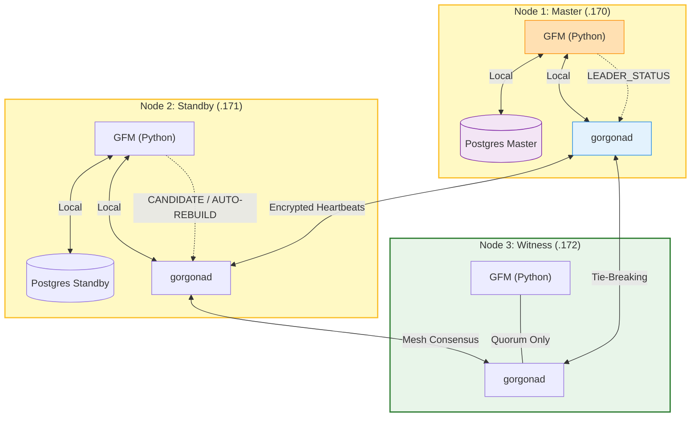

### GFM: Gorgona Failover Manager for PostgreSQL

**GFM** is a decentralized, high-availability (HA) management daemon for PostgreSQL. It uses the **Gorgona P2P Mesh Network** as an encrypted control plane to provide leader election, split-brain protection, and automated self-healing. 

Unlike traditional HA solutions, GFM does not require a centralized consensus store (like etcd, Consul, or ZooKeeper), making it ideal for distributed environments and edge computing.

---

### Core Features

- **P2P Orchestration:** Fully decentralized signaling via Gorgona Mesh.
- **LSN-Based Consensus:** Mathematical leader election based on the most advanced PostgreSQL Log Sequence Number (LSN).
- **Deterministic Tie-Breaking:** Alphabetical hostname priority ensures a single leader in case of identical LSNs.
- **Patroni-style Self-Healing:** Failed nodes automatically rejoin the cluster as Standby via `pg_rewind` or `pg_basebackup`.
- **Witness Support:** Lightweight arbitration node to prevent "Split-Brain" in 2-node database setups.
- **Encrypted Control Plane:** All cluster transitions and heartbeats are end-to-end encrypted.
- **Audit Logging:** Critical cluster events (promotions, fencing, rebuilds) are persisted in the mesh history for 24h+.

---

### Deployment & Installation

GFM includes a professional installer that automates host mapping and role provisioning.

#### 1. Prepare the Inventory (`nodes.list`)
Create a file named `nodes.list` in the installation directory. Database nodes are identified automatically; only the Witness role needs explicit marking.

```text
# IP Address      Role (Use 'witness' for arbiter nodes, leave empty for DB nodes)
192.168.1.170
192.168.1.171
192.168.1.172    witness
```

#### 2. Run the Installer
The `install.sh` script will configure `/etc/hosts`, deploy GFM scripts, and set up Systemd services across all nodes.

```bash
chmod +x install.sh
./install.sh
```

#### 3. Uninstall / Cleanup
To completely remove GFM and its configuration from the cluster:

```bash
chmod +x uninstall.sh
./uninstall.sh
```

---

### Configuration (`gfm.conf`)

GFM is configured via `/etc/gorgona/gfm.conf`. The installer generates this file automatically based on your `nodes.list`.

| Section | Parameter | Description |
| :--- | :--- | :--- |
| **[cluster]** | `my_pub_hash` | The public key hash for the encrypted control channel. |
| | `quorum_total_nodes` | Total node count used to calculate majority quorum. |
| **[timings]** | `heartbeat_interval` | Frequency of the Leader pulse (seconds). |
| | `max_missing_heartbeats` | Missing pulses allowed before election starts (default: 3). |
| | `heartbeat_ttl` | Expiry of pulse packets (default: 45s). |
| | `event_ttl` | Expiry of Audit Log events (default: 86400s / 24h). |
| **[paths]** | `psql_bin` | Path to `psql` (automatically discovered by installer). |
| | `rebuild_script` | Path to the recovery script (`gfm_rebuild.sh`). |

---

### Architecture & How It Works

#### 1. State Synchronization
Every 5 seconds, GFM probes the local Postgres instance. If the database is in Read-Write mode, the node asserts **LEADER**. If in Recovery, it remains **STANDBY**. If no database is detected, it enters **WITNESS** mode.

#### 2. Heartbeat & Monitoring
The Leader broadcasts a `LEADER_STATUS` packet. Standby nodes track these pulses. If silence exceeds the `ELECTION_TIMEOUT` ($interval \times missed + 5s$), the node starts an election.

#### 3. Conflict Resolution (Fencing)
If a conflict occurs (two Masters), GFM resolves it:
1. **Higher LSN wins.**
2. **If LSN is equal, the lower hostname alphabetically wins.**
The "losing" node immediately performs **Hard Fencing** (stops its Postgres instance) and triggers an **Auto-Rebuild**.

#### 4. Self-Healing (Auto-Rebuild)
A node will automatically trigger the `gfm_rebuild.sh` script if:
- It is a Standby and detects an empty database.
- It is a Standby and the replication link is broken while a Leader is active.
- It lost a leadership conflict.

---

### Cluster Workflow Diagram



---

### Operational Commands

Remote administration is performed via the Gorgona `send` utility using the `+I9IQuXYW8I=` channel.

| Command | Action |
| :--- | :--- |
| `gfm_health` | Returns a comprehensive health report (LSN, Sync Status, Role). |
| `gfm_status` | Returns the raw JSON cluster state. |
| `gfm_switchover` | Forces the current Master to step down and rejoin as a Replica. |
| `gfm_rebuild` | Manually triggers `pg_rewind` or `pg_basebackup`. |

**Example: Check Cluster Health**
```bash
gorgona send "$(date -u '+%Y-%m-%d %H:%M:%S')" "$(date -u -d '+1 min' '+%Y-%m-%d %H:%M:%S')" "gfm_health" "+I9IQuXYW8I=.pub"
```

---

### Failover Logic Flow
1. **Master Failure:** Standby stops receiving pulses $\rightarrow$ Timeout reached.
2. **Quorum Check:** Standby verifies it can see at least one other node (e.g., Witness).
3. **Candidacy:** Standby broadcasts `CANDIDATE` with its LSN $\rightarrow$ Wait 10s.
4. **Promotion:** No superior candidate found $\rightarrow$ `pg_ctl promote`.
5. **Recovery:** Old Master returns $\rightarrow$ Sees new Leader $\rightarrow$ `auto_rebuild` $\rightarrow$ Rejoins as Standby.

