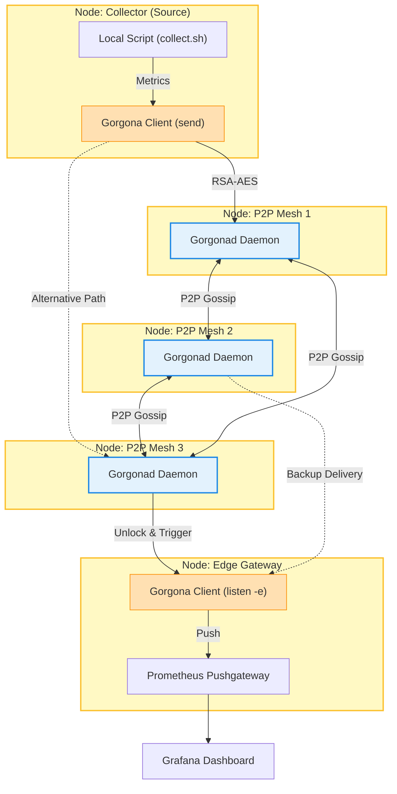

# `prom_push` Plugin for Gorgona

**The P2P Bridge for Resilient Prometheus Monitoring**

`prom_push` is a high-performance metrics exporter designed to collect local node telemetry and deliver it to a **Prometheus Pushgateway** via Gorgona’s encrypted P2P mesh network.

### Why `prom_push`?
In distributed clusters (Greenplum, Ceph, ClickHouse), standard Prometheus "Pull" models often fail during network partitioning or high CPU/IO load. If the master monitoring node cannot reach a segment, you lose visibility. 

**Gorgona `prom_push` solves this:**
1. **P2P Relay:** If a node is isolated from the main monitoring network but sees a P2P neighbor, it can "gossip" its metrics to a node that has internet/intranet access.
2. **Push-Model:** Ideal for ephemeral tasks or deeply firewalled segments.
3. **Zero-Dependency:** Written in pure C, ensuring minimal impact on the host's resources.

---

## Roadmap

### **Phase 1: Foundation (Core Metrics)**
- [ ] **Native Sys-Collector:** Minimalist collection of `Load Average`, `CPU Usage`, `Memory Pressure`, and `Disk Fill %`.
- [ ] **HTTP/1.1 Core:** Lightweight C-based HTTP POST engine to communicate with Prometheus Pushgateway.
- [ ] **P2P Transport:** Integration with Gorgona's internal replication to relay metric blobs across the mesh.

### **Phase 2: Database & Storage Specifics**
- [ ] **Greenplum/Postgres Module:** Check local segment status, active connections, and `D-state` process detection.
- [ ] **Ceph OSD Module:** Monitor local OSD latency and heartbeat status.
- [ ] **ClickHouse Module:** Track merge/mutation progress and part counts.

### **Phase 3: Intelligence & Self-Healing**
- [ ] **Threshold-Based Alerts:** Automatic "Emergency Push" when metrics cross critical limits (e.g., Disk > 95%).
- [ ] **Metric Aggregation:** Combine data from multiple P2P nodes into a single push to reduce Gateway load.
- [ ] **E2EE Telemetry:** Full RSA-AES encryption for metrics in transit, decrypted only at the edge node authorized to talk to Prometheus.

---

## Architecture



## Usage (Concept)

The plugin will be managed directly via Gorgona's configuration:

```bash
# Enable the plugin locally
gorgona plugin --load prom_push --interval 60 --gateway "http://10.0.0.50:9091"

# Metrics will be available in Prometheus as:
# gorgona_node_load_avg{instance="node_a", recipient="BQQCyN8..."} 0.45
```

##  Security
All telemetry data is treated with the same security level as Gorgona commands. Data can be encrypted using the public key of the Monitoring Edge node, ensuring that even if a P2P neighbor is compromised, your infrastructure telemetry remains private.

---
**Status:** Under Active Development  
**Language:** Pure C  
**Dependencies:** OpenSSL (for E2EE), Gorgona Core.
