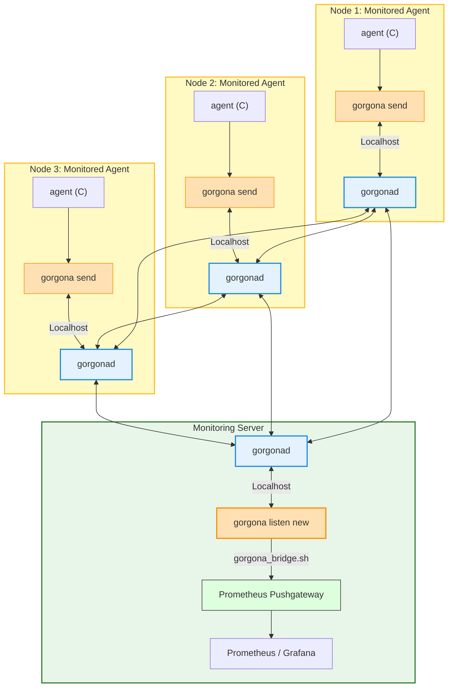
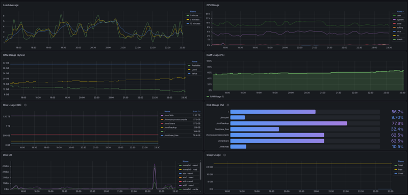

#### prom_push Plugin for Gorgona

**Resilient P2P Telemetry for Prometheus Monitoring**

The `prom_push` suite is a specialized monitoring solution designed to collect and deliver system telemetry through Gorgona’s encrypted P2P mesh network. It is specifically built for environments where standard Prometheus pull-based scraping is restricted by firewalls, NAT, or complex network topologies.

##### Core Concept

Traditional monitoring relies on a central server reaching out to every node (Pull model). In a Gorgona mesh, `prom_push` uses a Push model:
1. **Collection**: A lightweight C-based agent collects local system metrics.
2. **Transport**: Metrics are piped into Gorgona and gossiped across the P2P network.
3. **Ingestion**: A bridge component on the monitoring edge node receives the data stream and pushes it to a Prometheus Pushgateway.

This architecture ensures that as long as a node can see at least one peer in the Gorgona mesh, its metrics will eventually reach the monitoring server, even without a direct route to the Internet or the central management network.

#### System Components

##### 1. The Agent (C-Collector)
A zero-dependency binary written in pure C. It is designed for maximum efficiency and minimum resource footprint.
* **CPU**: Load Average (1/5/15m), User, System, Idle, and I/O Wait times.
* **Memory**: Total, Available, Free RAM, and Swap utilization.
* **Disk Usage**: Per-mountpoint capacity, used space, and availability.
* **Disk I/O**: Read/Write bytes and I/O time per device.
* **Network**: Received and Transmitted bytes/packets per interface.
* **Identity**: Automatic discovery of hostname and primary IP address.

##### 2. Gorgona Bridge (Ingestion Script)
A reactive Bash script that maintains a persistent subscription to the Gorgona mesh via `gorgona listen new`. 
* **Stream Processing**: Processes incoming telemetry in real-time.
* **Automatic Labeling**: Extracts host metadata from the stream to dynamically route metrics to the correct Prometheus instance label.
* **Reliability**: Designed to run as a systemd service with automatic restarts.

##### 3. Visualization: Multi-Host Node Monitor
The project includes a pre-configured Grafana dashboard: **Multi-Host Node Monitor (Pushgateway).json**.
* **Unified View**: Automatically discovers new nodes as they appear in the Gorgona mesh.
* **Resource Tracking**: Visualizes CPU pressure, Memory exhaustion, Disk fill rates, and Network throughput.
* **Push-Aware**: Tailored specifically to handle data coming from the Pushgateway, accounting for timestamp nuances and metric persistence.

#### Architecture



#### Deployment Summary

##### Monitored Node Setup
1. Compile the agent using the provided Makefile (`make`).
2. Install the binary to `/usr/local/bin`.
3. Configure a cron job or timer to execute `send_metrics.sh` at the desired interval (e.g., every 2 minutes).

##### Monitoring Server Setup
1. Install and start the Prometheus Pushgateway.
2. Configure Prometheus to scrape the Pushgateway with `honor_labels: true`.
3. Deploy the `gorgona-bridge.service` to ingest the P2P data stream.
4. Import the `Multi-Host Node Monitor (Pushgateway).json` into Grafana.

#### Security
Metrics are transported using Gorgona’s native security stack. Data is encrypted using the public key of the monitoring edge node. This ensures that telemetry remains private and cannot be read or tampered with by other nodes in the P2P mesh during transit.

#### Technical Specifications
* **Agent Language**: Pure C
* **Transport Protocol**: Gorgona P2P Mesh
* **Ingestion Format**: Prometheus Text Exposition Format (v0.0.4)
* **Dependencies**: 
    * Agent: Standard C Library (libc)
    * Bridge: Bash, Curl, Gorgona Client
    * Server: Prometheus Pushgateway, Prometheus Server, Grafana

#### Installation

##### 1. Monitored Nodes (C-Agent Setup)

Execute these steps on every server you wish to monitor.

**Build and Install the Agent**
```bash
# Navigate to the agent source directory
make
sudo make install
```

**Configure the Metric Upload Script**
Create a script to pipe metrics into Gorgona. Replace `<PUBLIC_KEY>` with the public key of your monitoring edge node.
```bash
# Create the script
sudo vim /usr/local/bin/send_metrics.sh

# Add the following content:
#!/bin/bash
/usr/local/bin/agent | /usr/bin/gorgona send "$(date -u '+%Y-%m-%d %H:%M:%S')" "$(date -u -d '+3 days' '+%Y-%m-%d %H:%M:%S')" - "<PUBLIC_KEY>.pub"

# Set execution permissions
sudo chmod +x /usr/local/bin/send_metrics.sh
```

**Schedule the Collection**
Add a cron job to run the agent every 2 minutes.
```bash
(crontab -l 2>/dev/null; echo "*/2 * * * * /usr/local/bin/send_metrics.sh") | crontab -
```

---

##### 2. Monitoring Server (Gateway and Bridge Setup)

Execute these steps on the server where Prometheus and Pushgateway are located.

**Install Prometheus Pushgateway**
```bash
# Download and install the binary
wget https://github.com/prometheus/pushgateway/releases/download/v1.11.2/pushgateway-1.11.2.linux-amd64.tar.gz
tar xvf pushgateway-1.11.2.linux-amd64.tar.gz
sudo cp pushgateway-1.11.2.linux-amd64/pushgateway /usr/local/bin/

# Create the systemd service
sudo nano /etc/systemd/system/pushgateway.service
```
Add the following service configuration:
```ini
[Unit]
Description=Prometheus Pushgateway
After=network.target

[Service]
Type=simple
User=prometheus
ExecStart=/usr/local/bin/pushgateway --web.listen-address=":9091"
Restart=always

[Install]
WantedBy=multi-user.target
```

**Configure Prometheus Scrape Job**
Add the following block to your `prometheus.yml`:
```yaml
scrape_configs:
  - job_name: 'pushgateway'
    honor_labels: true
    static_configs:
      - targets: ['localhost:9091']
```

**Install the Gorgona Bridge**
The bridge receives the P2P stream and pushes it to the Gateway.
```bash
# Create the bridge script
sudo nano /usr/local/bin/gorgona_bridge.sh
```
Add the script content (ensure `PUSHGATEWAY_URL` and `HASH` match your environment):
```bash
#!/bin/bash
PUSHGATEWAY_URL="http://localhost:9091"
JOB_NAME="gorgona_metrics"
HASH="<YOUR_RECIPIENT_HASH>"

stdbuf -oL gorgona listen new "$HASH" | while IFS= read -r line; do
    if [[ "$line" == node_* ]]; then
        if [[ "$line" == node_info* ]]; then
            current_hostname=$(echo "$line" | grep -oP 'hostname="\K[^"]+')
        fi
        buffer+="$line"$'\n'
    elif [[ -z "$line" ]] && [[ -n "$buffer" ]]; then
        instance_name=${current_hostname:-"unknown_host"}
        echo -n "$buffer" | curl -s --data-binary @- "$PUSHGATEWAY_URL/metrics/job/$JOB_NAME/instance/$instance_name"
        buffer=""
    fi
done
```

**Enable and Start Services**
```bash
sudo chmod +x /usr/local/bin/gorgona_bridge.sh

# Setup Bridge Service
sudo nano /etc/systemd/system/gorgona-bridge.service
# (Reference the gorgona_bridge.sh path in ExecStart)

sudo systemctl daemon-reload
sudo systemctl enable --now pushgateway
sudo systemctl enable --now gorgona-bridge
```

---

##### 3. Visualization Setup

**Grafana Dashboard**
1. Access your Grafana instance.
2. Navigate to **Dashboards > Import**.
3. Upload the `Multi-Host Node Monitor (Pushgateway).json` file.
4. Select your Prometheus data source and click **Import**.

##### Grafana Dashboard

| Gorgona Bridge |
|:---:|
| [](http://46.138.247.148:3000/d/adc5txg/multi-host-node-monitor-pushgateway-2) |

