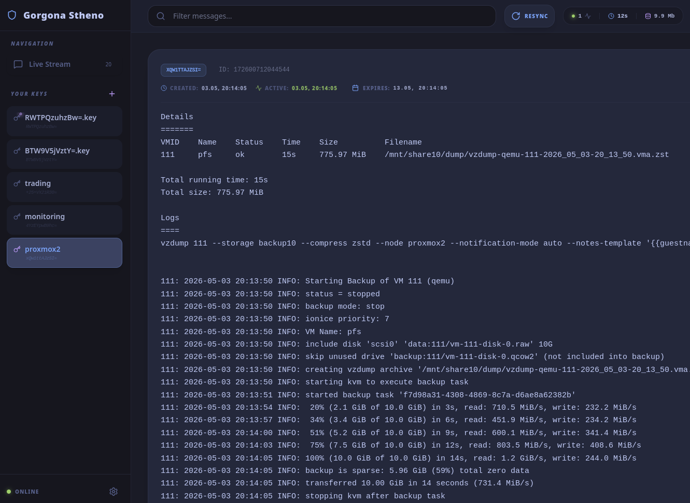
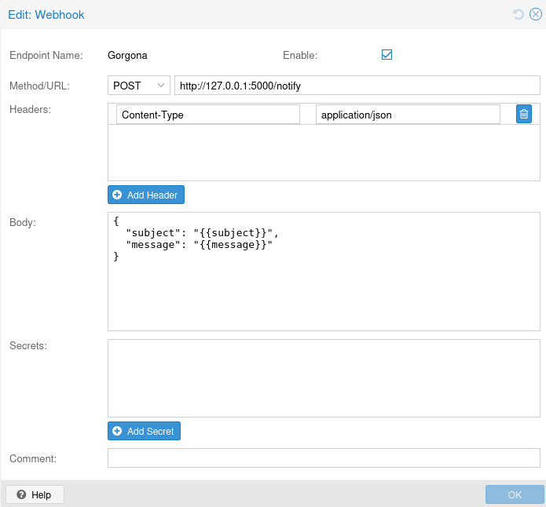

### Gorgona Notification Bridge for Proxmox VE

A lightweight Python-based bridge that receives Webhook notifications from **Proxmox VE (8.2+)** and forwards them to the **Gorgona P2P Mesh Network**.



#### Features
* **Multi-line Support:** Preserves the formatting of Proxmox backup logs.
* **Service-ready:** Includes a systemd unit file for background operation.
* **Safe:** Uses Python's `subprocess` for secure execution of Gorgona commands.
* **Diagnostic Logging:** Easy troubleshooting via `journalctl`.

#### Prerequisites
* **Proxmox VE 8.2** or higher (earlier versions do not support Webhooks natively).
* **Gorgona** binary installed and available in your PATH.
* **Python 3** and **Flask**.

---

### Installation

#### 1. Install Dependencies
On your Proxmox host, install the required Python library:
```bash
apt update && apt install python3-flask -y
```

#### 2. Setup the Bridge Script
Create a directory and save the bridge script:
```bash
mkdir -p /root/gorgona/plugins/proxmox
vim /root/gorgona/plugins/proxmox/bridge.py
```

#### 3. Create Systemd Service
To ensure the bridge starts automatically on boot:
```bash
vim /etc/systemd/system/gorgona-bridge.service
```
Paste this configuration:
```ini
[Unit]
Description=Gorgona Proxmox Bridge
After=network.target

[Service]
Type=simple
User=root
WorkingDirectory=/root/gorgona/plugins/proxmox
ExecStart=/usr/bin/python3 /root/gorgona/plugins/proxmox/bridge.py
Restart=always

[Install]
WantedBy=multi-user.target
```

**Enable and start the service:**
```bash
systemctl daemon-reload
systemctl enable --now gorgona-bridge
```

---

## Proxmox Configuration



1. Log in to the **Proxmox Web UI**.
2. Go to **Datacenter** -> **Notifications** -> **Targets**.
3. Click **Add** -> **Webhook**.
4. Configure the following:
    * **Name**: `Gorgona`
    * **URL**: `http://127.0.0.1:5000/notify`
    * **Method**: `POST`
5. Go to the **Headers** tab, click **Add**, and enter:
    * **Name**: `Content-Type`
    * **Value**: `application/json`
6. Go to the **Body** tab and paste:
   ```json
   {
     "subject": "{{subject}}",
     "message": "{{message}}"
   }
   ```
7. Click **Test** to verify the connection.

---

## Troubleshooting

**Check if the bridge is running:**
```bash
systemctl status gorgona-bridge
```

**View real-time logs:**
```bash
journalctl -u gorgona-bridge -f
```

**Common issues:**
* **Status 400:** Check if the "Body" JSON in Proxmox UI is valid.
* **Status 500:** Check if the `GORGONA_BIN` path and `PUBLIC_KEY` in `bridge.py` are correct.
