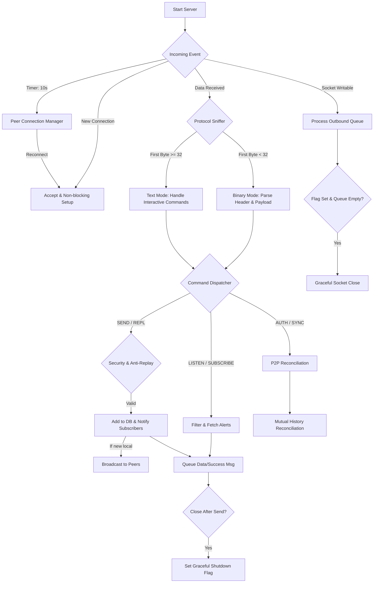

---
#### Gorgona. End-to-End Encrypted Time-Locked Messaging with Remote Command Execution 
- [Introduction](#introduction)
- [Features](#features)
- [Advantages](#advantages)
- [Quick Start](#quick-start)
- [Installation](#installation)
  - [Install Client](#install-client)
  - [Install Server](#install-server)
- [Usage](#usage)
  - [Flags](#flags)
  - [Generate Keys](#generate-keys)
  - [Send Message](#send-message)
  - [Listen for Messages](#listen-for-messages)
  - [Run Server](#run-server)
- [Configuration](#configuration)
  - [Client Configuration](#client-configuration)
  - [Server Configuration](#server-configuration)
- [Flowchart of Server Operation](#flowchart-of-server-operation)
- [Future Plans](#future-plans)
- [Testing](#testing) <a href="https://youtu.be/3JodTvfr88c"></a>
- [More examples](#more-examples)

---
##### Introduction

`gorgona` is a secure messaging system for sending encrypted messages that unlock at a specific time and expire after a set period. Using RSA for key exchange and AES-GCM for content encryption, `gorgona` ensures end-to-end privacy. The server stores only encrypted messages, unable to access their content, making it ideal for sensitive communications, scheduled notifications, or delayed message releases (e.g., time capsules or emergency data sharing, telemetry transport.).

The project includes a client (`gorgona`) for key generation, sending messages, and listening for alerts, and a server (`gorgonad`) for securely storing and delivering them.

##### Features

- **End-to-End Security**: Messages are encrypted using RSA-OAEP (key exchange) and AES-GCM (content). The server only handles encrypted blobs and never sees raw data.
- **Distributed Active-Active Replication**: Built-in P2P protocol for real-time alert synchronization and historical state reconciliation (Mutual Sync) between multiple servers.
- **Time-Locked Execution**: A decentralized "crypto-cron" with 1ms precision. Messages unlock exactly at `unlock_at` and expire after `expire_at`.
- **Anti-Replay Protection**: Integrated defense against network packet re-injection using staleness filters and sliding-window deduplication.
- **Remote Command Execution (RCE)**: Use the `-e/--exec` flag to trigger system commands upon decryption. Supports background daemons (`-d`) with centralized logging via `gorgona_LOG_FILE`.
- **Hybrid Protocol Sniffer**: Automatically detects and handles both binary length-prefixed packets (for data) and plain-text commands (for interactive telnet/health checks).
- **Flexible Persistence**: High-speed In-Memory mode or optional `mmap`-backed disk storage (`use_disk_db`) for reliability across server restarts.
- **Efficient Storage**: Automatic ring-buffer management and "Vacuum" auto-compacting to keep the database lean and fast.
- **Fast & Lightweight**: Zero-dependency implementation in pure C with OpenSSL; designed for high-concurrency and minimal resource footprint.

##### Advantages

- **High Availability**: If one server goes down, messages are preserved and accessible via other replicated nodes.
- **Uncompromised Security**: Messages remain confidential even if the server is breached.
- **Versatile Use Cases**: Ideal for personal reminders, corporate alerts, whistleblower tools, or automated data releases.
- **Scalable Architecture**: P2P replication allows building a fault-tolerant network without a single point of failure.
- **No Third-Party Reliance**: Operates locally or via direct client-server communication.
- **Flexible Storage Options**: Run in memory-only mode for high-speed, ephemeral operations or enable disk persistence for durability without losing alerts on server restarts.

##### Quick Start

```bash
git clone --depth 1 https://github.com/psqlmaster/gorgona.git && \
cd gorgona && \
make clean && make && \
sudo mkdir -p /etc/gorgona && \
printf "[server]\nip = 46.138.247.148\nport = 7777\n" | sudo tee /etc/gorgona/gorgona.conf >/dev/null && \
sudo mv RWTPQzuhzBw=.pub RWTPQzuhzBw=.key /etc/gorgona/ && \
sudo cp ./gorgona /usr/bin && \
gorgona listen last 4 RWTPQzuhzBw=
```

##### Installation

Clone the repository:

```bash
git clone https://github.com/psqlmaster/gorgona.git
cd gorgona
```

Install dependencies (OpenSSL required):

- On Debian/Ubuntu: `sudo apt update && sudo apt install -y libssl-dev git gcc make`
- On Fedora: `sudo dnf install openssl-devel`
- On REDOS: `sudo yum install openssl11 openssl11-devel`
- On centos: `sudo yum install -y git gcc make pkgconfig check check-devel openssl-devel`
- On macOS: `brew install openssl`

> Note: Tested on Debian, Fedora, Centos and RED OS.

Build the project:

```bash
make clean && make
```

Builds `gorgona` (client) and `gorgonad` (server). Clean: `make clean`. Rebuild: `make rebuild`.

### [Install Client](https://github.com/psqlmaster/gorgona/releases)

```bash
sudo dpkg -i ./gorgona_2.5.8_amd64.deb
```

### [Install Server](https://github.com/psqlmaster/gorgona/releases)

```bash
sudo dpkg -i ./gorgonad_2.5.8_amd64.deb
```

##### Usage

```bash
gorgona [-v|--verbose] [-e|--exec] [-d|--daemon-exec] [-h|--help] [-V|--version] <command> [arguments]
```
---

##### Anti-Replay Protection

Gorgona includes a dual-layer defense mechanism to prevent attackers from capturing and re-sending encrypted command packets:

1. **Staleness Filter**: The server rejects any message where the `unlock_at` timestamp is older than 120 seconds from the current server time. This prevents the re-injection of old captured traffic.
2. **Binary Deduplication**: The server maintains a sliding window of the last 50 payloads per recipient. Since AES-GCM ensures a unique ciphertext for every legitimate encryption (due to unique IVs), any identical binary payload is instantly flagged as a replay attack and rejected.

If an attack is detected, the server logs the event as a `WARN` (including client IP) and returns a specific error to the sender:
`Error: Replay attack detected (duplicate payload)`

---
##### Flags

- `-v, --verbose`: Enables verbose output for debugging.
- `-e, --exec`: For 'listen' command: execute messages as system commands (requires `pubkey_hash_b64`).
- `-d, --daemon-exec`: Used with `-e/--exec` for 'listen' command: executes messages as **background daemons** (via `fork()` + `setsid()`).  
      Output from executed commands is written to the file specified by the environment variable `gorgona_LOG_FILE` (e.g., `gorgona_LOG_FILE=/var/log/gorgona.log gorgona -ed listen new ...`).  
      If `gorgona_LOG_FILE` is not set, command output is discarded (`/dev/null`).
  - If the `[exec_commands]` section in `/etc/gorgona/gorgona.conf` is empty, all decrypted messages are executed.
  - If `[exec_commands]` contains entries (e.g., `greengage start = /path/to/script.sh`), only messages matching a key are executed by running the corresponding script.
- `-h, --help`: Displays help message.
- `-V, --version`: Current version.

> Note: Flags `-v` and `-e` can be combined (e.g., `-ve`) for verbose output during command execution.

##### Generate Keys

```bash
sudo gorgona genkeys
```

Generates an RSA key pair in `/etc/gorgona/`, creating `hash.pub` (public key) and `hash.key` (private key), where `hash` is the base64-encoded hash of the public key.

The `hash` in name file `hash.pub` is used to specify the sender in the `listen` command; if omitted, messages for all `*.pub` keys in `/etc/gorgona/` are retrieved.

To decrypt messages, the recipient must have the sender’s `hash.key` private key in `/etc/gorgona/`, which must be securely shared by the user.

**Key Permissions**: Private keys (`*.key`) should be readable only by the owner (`chmod 600`). Public keys (`*.pub`) can be world-readable (`chmod 644`). Check permissions with:

```bash
ls -la /etc/gorgona
```

### Send Message 
- (datetime UTC) or date -u '+%Y-%m-%d %H:%M:%S'

```bash
# gorgona send <data unlock message> <data expired> "Your message" "recipient.pub"
gorgona send "YYYY-MM-DD HH:MM:SS" "YYYY-MM-DD HH:MM:SS" "Your message" "recipient.pub"
```

Use `-` for `<message>` to read from stdin. 
The public key file is the filename in `/etc/gorgona/`, e.g., `RWTPQzuhzBw=.pub`.

**Examples**:

```bash
gorgona send "$(date -u '+%Y-%m-%d %H:%M:%S')" "$(date -u -d '+30 days' '+%Y-%m-%d %H:%M:%S')" "hello world" "RWTPQzuhzBw=.pub"
gorgona send "$(date -u -d '+30 seconds' '+%Y-%m-%d %H:%M:%S')" "$(date -u -d '+30 days' '+%Y-%m-%d %H:%M:%S')" "Message in the future for you my dear friend RWTPQzuhzBw=" "RWTPQzuhzBw=.pub"
cat message.txt | gorgona send "$(date -u '+%Y-%m-%d %H:%M:%S')" "$(date -u -d '+30 days' '+%Y-%m-%d %H:%M:%S')" - "RWTPQzuhzBw=.pub"
```

### Listen for Messages

```bash
gorgona listen <mode> [<count>] [pubkey_hash_b64]
```

**Modes**:
- `live`:   Only active messages (`unlock_at <= now`).
- `all`:    All non-expired messages, including locked.
- `lock`:   Only locked messages (`unlock_at > now`).
- `single`: Only active messages for the given `pubkey_hash_b64`.
- `last`:   the most recent [<count>] message(s), (count defaults to 1), optionally filtered by pubkey_hash_b64
- `new`:    Only new messages received after connection, optionally filtered by `pubkey_hash_b64`.

If `pubkey_hash_b64` is provided, filters by it (mandatory for `single` and `last`).

**Examples**:

```bash
# Examples: Listen modes
gorgona listen single RWTPQzuhzBw=     # Gets the message from single key
gorgona listen last RWTPQzuhzBw=       # Gets the last 1 message
gorgona listen last 3 RWTPQzuhzBw=     # Gets the last 3 messages
gorgona listen new RWTPQzuhzBw=        # Receives only new messages from the moment of connection
gorgona listen new                     # Receives only new messages for all keys since connection
# Time-Locked Command Execution (cron-like)
# Start listener in lock mode - it will execute the command exactly at unlock time
gorgona -e listen lock RWTPQzuhzBw=
# In another terminal: send a command that unlocks in 10 seconds
gorgona send "$(date -u -d '+10 seconds' '+%Y-%m-%d %H:%M:%S')" "$(date -u -d '+30 days' '+%Y-%m-%d %H:%M:%S')" "{ date; uptime; }" "RWTPQzuhzBw=.pub"
# After ~10s the listener with -e executes the decrypted command at unlock_at
# Same lock mode but without execution: decrypt & display at unlock time
# Start listener (no -e) - message is queued and shown when unlocked
gorgona listen lock RWTPQzuhzBw=
# Send the same message (unlocks in 10s) from another terminal
gorgona send "$(date -u -d '+10 seconds' '+%Y-%m-%d %H:%M:%S')" "$(date -u -d '+30 days' '+%Y-%m-%d %H:%M:%S')" "test message" "RWTPQzuhzBw=.pub"
# After ~10s the listener without -e prints: "Unlocked pending message ID=..." and the decrypted text
gorgona -ed listen new RWTPQzuhzBw=     # Listens for new messages and executes them as background daemons
gorgona_LOG_FILE=/var/log/gorgona.log gorgona -edv listen lock RWTPQzuhzBw=  # Executes locked commands in background with logging command output to a central log
```

- You can check server status from any device using standard telnet/nc
```bash 
echo "info" | nc 46.138.247.148 7777
# Output:
# Gorgona Server 2.7.2
# Uptime: 12d 4h 20m
# Max message size: 5242880 bytes
# Max clients: 100
```

##### Run Server

```bash
gorgonad [-v|--verbose] [-h|--help] [-V|--version]
```
- The server reads settings from `/etc/gorgona/gorgonad.conf` or uses defaults (port = 5555, max alerts = 1000, max clients = 100, log_level = "info", use_disk_db = false).
- Use `-h` or `--help` for configuration help.  
- Use `-v` for verbose mode, example:

```bash
strace -e network gorgona -v listen new RWTPQzuhzBw=
```

The server reads settings from `/etc/gorgona/gorgonad.conf` or uses defaults (port: 5555, max alerts: 1024, max clients: 100).

##### Configuration

##### Client Configuration (Variant A)

The file `/etc/gorgona/gorgona.conf` contains server settings and optional execution mappings:

```ini
[server]
ip = 46.138.247.148 
port = 7777

[exec_commands]
<key> = <script_path>
```

**Example**:

```ini
[exec_commands]
app start = /home/su/repository/c/gorgona/test/script.sh
```

##### Recommended (Variant B) - per-key sections
---

Prefer using named subsections to group commands by required public-key hash. This is explicit, easy to read, and less error-prone.

```ini
[exec_commands:RWTPQzuhzBw=]
weather = /usr/local/bin/gorgona_weather_sender.sh
greengage start = /root/scripts/greengage_start.sh

[exec_commands:IcUimbs6LZY=]
la = /root/scripts/la.sh
vm list running = /root/scripts/qm_list_running.sh

[exec_commands]   ; global commands, available for all keys
sysadmin = /usr/local/bin/gorgona_sysadmin.sh
```

Notes:
- A header `[exec_commands:KEY]` binds all key/value lines inside to `required_key=KEY`. Only messages decrypted with the matching private key (i.e., whose `pubkey_hash_b64` equals `KEY`) may execute those commands when `-e/--exec` is used.
- `[exec_commands]` (without suffix) is the global section — commands there are available to messages from any key.
- This format is both human-editable and easy to generate with configuration management tools (Ansible, Chef, etc.).

Backward compatibility:
- The parser also accepts the older minimal form `key = <value>` inside `[exec_commands]` (legacy), but using per-key sections is recommended.

##### Wrapper Script Support for Complex Commands
- For complex shell commands with pipes, variables, or dynamic content, use wrapper scripts instead of inline commands. 
- This avoids shell escaping issues and provides better maintainability. Arguments from gorgona messages are passed to the script as $1, $2, $3...

**Example: Remote Service & Log Manager**
- /usr/local/bin/gorgona_sysadmin.sh
```bash
#!/bin/bash

# Arguments: $1=action, $2=service, $3=parameter (optional)
# Usage examples:
#   sysadmin restart nginx
#   sysadmin logs postgres 100
#   sysadmin status sshd
#   sysadmin kill zombie 5

export PATH="/usr/local/sbin:/usr/local/bin:/usr/sbin:/usr/bin:/sbin:/bin"

ACTION="${1:-help}"
SERVICE="${2:-}"
PARAM="${3:-}"

TIMESTAMP=$(date -u '+%Y-%m-%d %H:%M:%S')
PUBKEY="RWTPQzuhzBw=.pub"

case "$ACTION" in
    restart)
        RESULT=$(systemctl restart "$SERVICE" 2>&1 && echo "✓ $SERVICE restarted" || echo "✗ Failed to restart $SERVICE")
        ;;
    status)
        RESULT=$(systemctl status "$SERVICE" --no-pager 2>&1 | head -10)
        ;;
    logs)
        LINES="${PARAM:-50}"
        RESULT=$(journalctl -u "$SERVICE" --no-pager -n "$LINES" 2>&1)
        ;;
    kill)
        PATTERN="${PARAM:-$SERVICE}"
        RESULT=$(pkill -9 -f "$PATTERN" 2>&1 && echo "✓ Processes killed" || echo "✗ No processes found")
        ;;
    disk)
        # ИСПРАВЛЕНО: PATH -> CHECK_PATH (не перезаписывать системную переменную!)
        CHECK_PATH="${SERVICE:-/}"
        RESULT=$(du -sh "$CHECK_PATH" 2>&1 && df -h "$CHECK_PATH" 2>&1 | tail -1)
        ;;
    help|*)
        RESULT="Available: restart|status|logs|kill|disk <service> [param]"
        ;;
esac

echo "[$TIMESTAMP] $ACTION $SERVICE $PARAM
$RESULT" | /usr/bin/gorgona send "$TIMESTAMP" "$(date -u -d '+1 day' '+%Y-%m-%d %H:%M:%S')" - "$PUBKEY"
```
**Make it executable:**
```bash
chmod +x /usr/local/bin/gorgona_sysadmin.sh
```
**Configure exec_commands**
- Edit /etc/gorgona/gorgona.conf:
```ini
[server]
ip = 46.138.247.148
port = 7777

[exec_commands]
sysadmin = /usr/local/bin/gorgona_sysadmin.sh
```
**Usage Examples**
```bash
# Terminal 1: Start listener to execute commands at the exact 'unlock' moment
gorgona -e listen lock RWTPQzuhzBw=

# Terminal 2: Send a command to unlock exactly in 60 seconds
gorgona send "$(date -u -d '+60 seconds' '+%Y-%m-%d %H:%M:%S')" \
             "$(date -u -d '+1 day' '+%Y-%m-%d %H:%M:%S')" \
             "systemctl restart nginx" "RWTPQzuhzBw=.pub"
# example output:
# Decrypted message:
# [2026-03-01 14:49:48] restart nginx 
# ✓ nginx restarted

# Get last 100 lines of postgres logs
gorgona send "$(date -u '+%Y-%m-%d %H:%M:%S')" "$(date -u -d '+1 hour' '+%Y-%m-%d %H:%M:%S')" \
"sysadmin logs nginx 3" "RWTPQzuhzBw=.pub" && gorgona listen new
# example output:
# Decrypted message:
# [2026-03-01 14:49:21] logs nginx 3
# Feb 27 16:34:09 hostname nginx[1738727]: 2026/02/27 16:34:09 [warn] 1738727#1738727: conflicting server name "hostname.org" on 0.0.0.0:443, ignored
# Feb 27 16:34:09 hostname nginx[1738735]: 2026/02/27 16:34:09 [warn] 1738735#1738735: conflicting server name "hostname.org" on 0.0.0.0:80, ignored
# Feb 27 16:34:09 hostname nginx[1738735]: 2026/02/27 16:34:09 [warn] 1738735#1738735: conflicting server name "hostname.org" on 0.0.0.0:443, ignored

# Check sshd service status
gorgona send "$(date -u '+%Y-%m-%d %H:%M:%S')" "$(date -u -d '+1 hour' '+%Y-%m-%d %H:%M:%S')" \
"sysadmin status sshd" "RWTPQzuhzBw=.pub" && gorgona listen new
# example output:
# Decrypted message:
# sysadmin status sshd
# Received message: Pubkey_Hash=RWTPQzuhzBw=
# ID: 150268099387392
# Metadata (local): Create=2026-03-01 17:42:27, Unlock=2026-03-01 17:42:27, Expire=2026-03-02 17:42:27
# Decrypted message:
# [2026-03-01 14:42:27] status sshd 
# ● ssh.service - OpenBSD Secure Shell server
#      Loaded: loaded (/lib/systemd/system/ssh.service; enabled; preset: enabled)
#      Active: active (running) since Fri 2026-02-27 16:34:11 MSK; 2 days ago
#        Docs: man:sshd(8)
#              man:sshd_config(5)
#     Process: 1738962 ExecStartPre=/usr/sbin/sshd -t (code=exited, status=0/SUCCESS)
#    Main PID: 1738963 (sshd)
#       Tasks: 1 (limit: 153344)
#      Memory: 3.3M
#         CPU: 91ms

# Kill all zombie processes
gorgona send "$(date -u '+%Y-%m-%d %H:%M:%S')" "$(date -u -d '+1 hour' '+%Y-%m-%d %H:%M:%S')" \
"sysadmin kill zombie" "RWTPQzuhzBw=.pub" && gorgona listen new

# Check disk usage of /var/log
gorgona send "$(date -u '+%Y-%m-%d %H:%M:%S')" "$(date -u -d '+1 hour' '+%Y-%m-%d %H:%M:%S')" \
"sysadmin disk /var/log" "RWTPQzuhzBw=.pub" && gorgona listen new
# example output:
# Decrypted message:
# [2026-03-01 14:36:04] disk /var/log 
# 2.1G	/var/log
# /dev/mapper/pve-root   94G   63G   27G  71% /

# Listen and execute automatically
gorgona -ed listen new RWTPQzuhzBw=
```

### Server Configuration

Edit `/etc/gorgona/gorgonad.conf`:

```ini
[server]
port = 7777                      # Server port
max_alerts = 10000               # Max alerts for one key
max_clients = 100                # Max counts parallel clients
max_log_size = 10                # MB (default: 10)
log_level = info                 # info or error (default: info)
max_message_size = 5             # MB (default: 5)
use_disk_db = true               # Enable (true) or disable (false) persistent disk storage for alerts (default: false)
vacuum_threshold_percent = 100   # Cleanup threshold %: higher reduces disk I/O, lower saves disk space (default: 25)

[replication]
sync_psk = BQQCyN8zo4La2lRSIQ2jLp5imEa0JzdXp2PKogP3   # sync_node_password
peer = 64.188.70.158:7777        # Remote peer address to sync with
```

> **Pro Tip: Debugging**
> Running `gorgonad -v` (verbose) will print **all** levels (including DEBUG) to your terminal in real-time, regardless of the `log_level` set in the config file. This is ideal for troubleshooting without bloating your `gorgonad.log`.

---

### Flowchart of Server Operation

The server uses a high-performance `select()`-based multiplexing loop to handle binary and text protocols simultaneously.


<details>
<summary><b>Click to view detailed internal logic (Packet parsing, State machine, DB Sync)</b></summary>

```ini
[Server Start]
   |
   v
[Initialization]
   - Read configuration (/etc/gorgona/gorgonad.conf)
   - Initialize Global Data: client_sockets[MAX_CLIENTS], subscribers[MAX_CLIENTS]
   - Setup Logging: Open gorgonad.log (Supports: error, info, debug)
   - If use_disk_db == true:
   |  - Load Recipients from /var/lib/gorgona/alerts/
   |  - mmap() existing .alerts files into memory
   |  - Scan files for active records -> Set used_size & recipient_count
   |
   v
[Socket Creation]
   - socket(), setsockopt(SO_REUSEADDR), bind(), listen()
   - Set server_fd to O_NONBLOCK
   - Register Signal Handlers (SIGINT/SIGTERM for shutdown, SIGPIPE ignore)
   |
   v
[Main Loop (run_server)]
   |
   |--[1] Prepare select() FD Sets:
   |      - Add server_fd to readfds
   |      - For each active client:
   |         - Add to readfds (only if close_after_send is false)
   |         - Add to writefds (if has_pending_data is true: out_head != NULL)
   |
   |--[2] select(max_sd + 1, &readfds, &writefds, NULL, NULL)
   |
   |--[3] Handle NEW CONNECTION (FD_ISSET server_fd):
   |      - accept() -> check max_clients limit
   |      - If OK: fcntl(O_NONBLOCK) -> Initialize Subscriber struct
   |         - Set read_state = READ_LEN, in_pos = 0, close_after_send = false
   |
   |--[4] Handle WRITABLE Client (FD_ISSET in writefds):
   |      - Call process_out(sub_index, sd):
   |         - Loop through OutBuffer queue -> send() payload chunks
   |         - If sent < len: Update pos -> Break (wait for next select)
   |         - If sent == len: Free buffer -> Move to next OutBuffer
   |         - If queue empty AND close_after_send == true:
   |            - Close socket -> Reset Subscriber struct -> Log "Task completed"
   |
   |--[5] Handle READABLE Client (FD_ISSET in readfds):
   |      |
   |      |----> [State: READ_LEN (Protocol Sniffer)]
   |      |         - Read 1 byte into in_buffer
   |      |         - If byte < 32 AND not (\n, \r, \t): BINARY PROTOCOL
   |      |            - Collect 4 bytes -> ntohl() -> expected_msg_len
   |      |            - If length > max_message_size:
   |      |               - Enqueue Error Msg -> Set close_after_send = true -> continue
   |      |            - Allocate in_buffer -> Set read_state = READ_MSG
   |      |         - Else: TEXT PROTOCOL (Interactive/Telnet)
   |      |            - Buffer bytes until '\n' -> trim_string()
   |      |            - If "info"/"version"/"?":
   |      |               - Format response -> enqueue_text_only() -> Set close_after_send = true
   |      |            - Else: Log "Unknown text command" -> Set close_after_send = true
   |      |
   |      |----> [State: READ_MSG (Data Collection)]
   |      |         - Read up to expected_msg_len into in_buffer
   |      |         - If complete: 
   |      |            - handle_command(sub_index, in_buffer) -> See [Dispatcher]
   |      |            - Free in_buffer -> Reset in_pos -> Set read_state = READ_LEN
   |
   v
[Command Dispatcher (handle_command)]
   |
   |----> [SEND|...]
   |         - Parse fields: hash, unlock_at, expire_at, payload, key, iv, tag
   |         - add_alert() -> Security Checks:
   |            - Layer 1: Staleness Check (Reject if unlock_at is > 120s in the past)
   |            - Layer 2: Binary Deduplication (Compare payload with last 50 alerts)
   |            - If Security Check Fails: Enqueue Error (Stale/Replay) -> return
   |            - If Valid: Save to DB (mmap if enabled) -> Log success
   |         - notify_subscribers():
   |            - Filter active clients by mode (LIVE/ALL/LOCK/NEW) and hash match
   |            - Format ALERT|... message -> enqueue_message() for each match
   |
   |----> [LISTEN|... / SUBSCRIBE ]
   |         - Parse: mode, hash, count
   |         - Update Subscriber mode/pubkey_hash
   |         - send_current_alerts():
   |            - Sort & Filter alerts by ID/mode/timestamps
   |            - For each match: base64_encode() -> enqueue_message()
   |         - If mode == LAST: Set close_after_send = true
   |
   v
[Background Maintenance]
   - Log Rotation: If size > max_log_size -> rename gorgonad.log to .log.1
   - DB Vacuum: If use_disk_db AND waste_count exceeds threshold:
   |  - alert_db_sync(): Rebuild .alerts file (compact) -> remap mmap
   - Logging: log_event(level, ...)
      - If verbose (-v): Always print to stdout (ignore config filters)
      - If log_level matches config (debug/info/error): Write to file
```
</details>

---

##### Future Plans

`gorgona` works efficiently with a single server. Future plans include server mirroring (replication) without external services (Redis, PostgreSQL) for speed, decentralization, and reliability. Possible approaches: gossip protocol for peer-to-peer synchronization or lightweight consensus (e.g., adapted Raft). Also considering blockchain-inspired ledgers (without mining) or CRDT for seamless sync. Suggestions welcome!

##### Testing

[](https://youtu.be/3JodTvfr88c)

Watch the quick 30‑minute demo on YouTube: https://youtu.be/3JodTvfr88c
```bash
# To run the test suite, use the following command:
make clean && make test
```

##### More examples
```bash
# send
lsblk | gorgona send "$(date -u '+%Y-%m-%d %H:%M:%S')" "$(date -u -d '+30 days' '+%Y-%m-%d %H:%M:%S')" - "RWTPQzuhzBw=.pub"
# Server response: Alert added successfully

# get
gorgona listen last RWTPQzuhzBw=
# Received message: Pubkey_Hash=RWTPQzuhzBw=
# Metadata: Create=2025-10-08 08:39:52, Unlock=2025-09-28 18:44:00, Expire=2025-12-30 09:00:00
# Decrypted message: [output of lsblk]

# send command message
gorgona send "$(date -u '+%Y-%m-%d %H:%M:%S')" "$(date -u -d '+30 days' '+%Y-%m-%d %H:%M:%S')" "echo \$(date)" "RWTPQzuhzBw=.pub"

# listen execute command message
gorgona -e listen new RWTPQzuhzBw=
# Server response: Subscribed to new for the specified key
# Received message: ...
# Executing command: echo $(date)
# Sat Oct 11 10:32:49 PM MSK 2025
# Command return code: 0
```

 >**Hack for the most patient** - if you want not only to run a command on a remote host but also to receive its output, do it like this:

 ```bash
 gorgona send "$(date -u '+%Y-%m-%d %H:%M:%S')" "$(date -u -d '+30 days' '+%Y-%m-%d %H:%M:%S')" "iostat -d | \
 gorgona send \"2025-09-28 21:44:00\" \"2030-12-30 12:00:00\" - \"RWTPQzuhzBw=.pub\"" "IcUimbs6LZY=.pub"
 ```

- If we listen on that channel:
 ```bash
 gorgona listen new RWTPQzuhzBw=
 gorgona listen last RWTPQzuhzBw=
 ```

 - we immediately get a reply with the output of `iostat`.
 **Added service for listen messages in mode `--exec`**:
 ```bash
 sudo tee /tmp/mkdir.sh  /dev/null << 'EOF'
 mkdir -p /tmp/test/test1/test2/test3 && cd /tmp/test/test1/test2/test3 && pwd | \
 gorgona send "2025-10-05 18:42:00" "2030-10-09 09:00:00" - "RWTPQzuhzBw=.pub"
 EOF
 
 chmod +x /tmp/mkdir.sh
 
 sudo tee /etc/gorgona/gorgona.conf  /dev/null << 'EOF'
 [server]
 ip = 46.138.247.148 
 port = 7777
 [exec_commands]
 mkdir testdir = /tmp/mkdir.sh
 EOF
 
 sudo tee /etc/systemd/system/gorgona.service  /dev/null << 'EOF'
 [Unit]
 Description=gorgona Message Listener
 After=network-online.target
 Wants=network-online.target
 
 [Service]
 Type=simple
 ExecStart=/usr/bin/gorgona -ed listen new RWTPQzuhzBw=  ##### -d process is daemon #####
 Restart=always
 RestartSec=5
 StartLimitBurst=10
 StartLimitIntervalSec=300
 User=root
 StandardOutput=journal
 StandardError=append:/var/log/gorgona_service.log
 KillMode=mixed
 TimeoutStopSec=30
 Environment=gorgona_LOG_FILE=/var/log/gorgona_service.log
 
 [Install]
 WantedBy=multi-user.target
 EOF
 
 sudo chmod 644 /etc/systemd/system/gorgona.service && \
 sudo systemctl daemon-reload && \
 sudo systemctl enable gorgona && \
 sudo systemctl start gorgona

sudo touch /var/log/gorgona_service.log
sudo chown user:user /var/log/gorgona_service.log
sudo chmod 644 /var/log/gorgona_service.log
 ```

```bash
# in new terminal, only mkdir
gorgona send "$(date -u '+%Y-%m-%d %H:%M:%S')" "$(date -u -d '+30 days' '+%Y-%m-%d %H:%M:%S')" "mkdir testdir" "RWTPQzuhzBw=.pub"

# mkdir & output message
gorgona listen new RWTPQzuhzBw= & pid=$!; gorgona send "$(date -u '+%Y-%m-%d %H:%M:%S')" "$(date -u -d '+30 days' '+%Y-%m-%d %H:%M:%S')" "mkdir testdir" "RWTPQzuhzBw=.pub"; sleep 2; kill $pid
```
- Time-Locked Command Execution (Cron-like)
```sh
# Start listener in lock mode - it will execute the command exactly at unlock time (v - verbose mode)
gorgona -ev listen lock RWTPQzuhzBw=
# In another terminal Send a command that unlocks alert in 10 seconds
gorgona send "$(date -u -d '+10 seconds' '+%Y-%m-%d %H:%M:%S')" "$(date -u -d '+30 days' '+%Y-%m-%d %H:%M:%S')" "{ date; uptime; }" "RWTPQzuhzBw=.pub"
# Check and compare the time after 10 seconds. 
```
- Server Status via Telnet
```sh
telnet 46.138.247.148 7777
```
    Trying 46.138.247.148...
    Connected to 46.138.247.148.
    Escape character is '^]'.
    info
    Gorgona Alert Server 2.4.1
    Uptime: 1d 21h 45m
    Max message size: 5242880 bytes
    Max clients: 100
    https://github.com/psqlmaster/gorgona

- example starting service
```sh
# vim /etc/systemd/system/greenplum.service
[Unit] 
Description=Greenplum Database Cluster 
After=network.target 
Wants=network-online.target 
 
[Service] 
Type=forking 
User=gpadmin 
Group=gpadmin 
Environment=GPHOME=/usr/lib/gpdb 
Environment=MASTER_DATA_DIRECTORY=/data1/master/gpseg-1 
Environment=PATH=/usr/lib/gpdb/bin:/usr/local/bin:/usr/bin:/bin 
Environment=LD_LIBRARY_PATH=/usr/lib/gpdb/lib 
Environment=LC_ALL=en_US.UTF-8 
ExecStart=/usr/lib/gpdb/bin/gpstart -a 
ExecStop=/usr/lib/gpdb/bin/gpstop -aM fast 
PIDFile=/data1/master/gpseg-1/postmaster.pid 
TimeoutSec=300 
 
[Install] 
WantedBy=multi-user.target
```
```sh
# vim /etc/gorgona/gorgona.conf
[exec_commands]
start greenplum = /bin/systemctl start greenplum
stop greenplum  = /bin/systemctl stop greenplum
```
