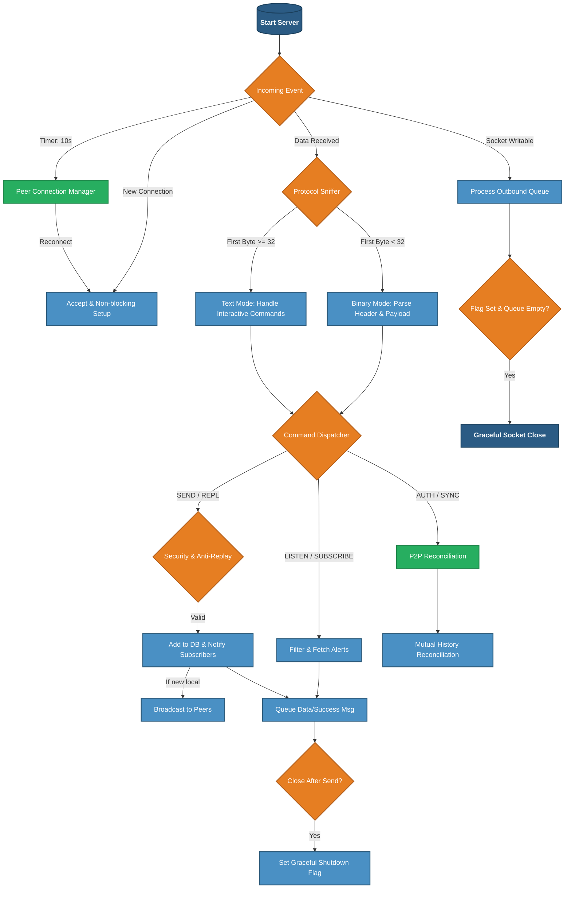
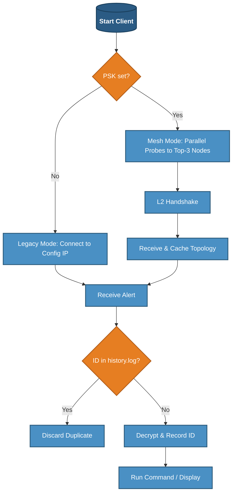

---
#### Gorgona. Decentralized P2P Distributed Cron & Remote Execution Engine. End-to-End Encrypted, Time-Locked, and Resilient.  
>[📖 -> How I wrote a distributed Cron in C with P2P replication](docs/story.md)

- [Introduction](#introduction)
- [Features](#features)
- [Advantages](#advantages)
- [Quick Start](#quick-start)
- [Installation](#installation)
  - [Install Client](#install-client)
  - [Install Server](#install-server)
- [Configuration](#configuration)
  - [Server Configuration (gorgonad.conf)](#server-configuration-gorgonadconf)
  - [Client Configuration (gorgona.conf)](#client-configuration-gorgonaconf)
  - [Service Installation (systemd)](#service-installation-systemd)
- [Usage](#usage)
  - [Flags](#flags)
  - [Generate Keys](#generate-keys)
  - [Send Message](#send-message)
  - [Listen for Messages](#listen-for-messages)
  - [Run Server](#run-server)
- [Configuration](#configuration)
  - [Client Configuration](#client-configuration)
  - [Server Configuration](#server-configuration)
- [Flowchart of Server Operation](#flowchart-of-server-operation)
- [Monitoring & Observability](#monitoring--observability)
- [Future Plans & Evolution](#future-plans--evolution)
- [Testing](#testing) <a href="https://youtu.be/3JodTvfr88c"></a>
- [More examples](#more-examples)

---
#### Introduction

`gorgona` is a secure messaging system for sending encrypted messages that unlock at a specific time and expire after a set period. Using RSA for key exchange and AES-GCM for content encryption, `gorgona` ensures end-to-end privacy. The server stores only encrypted messages, unable to access their content, making it ideal for sensitive communications, scheduled notifications, or delayed message releases (e.g., time capsules or emergency data sharing, telemetry transport.).
The project includes an **Autonomous Intelligent Client** (`gorgona`) that features self-healing connectivity, parallel peer probing (Happy Eyeballs), and a local execution history to guarantee exactly-once processing across a distributed mesh.

The project includes a client (`gorgona`) for key generation, sending messages, and listening for alerts, and a server (`gorgonad`) for securely storing and delivering them.

#### Features

- **Dual-Layer Cryptography**: Total security isolation.
    - **Layer 1 (Command Plane)**: End-to-End security using RSA-OAEP for key transport and AES-256-GCM for content. The server acts as a "blind carrier" and never sees raw data.
    - **Layer 2 (Management Plane)**: Administrative traffic (PEX, Sync, Heartbeats) is encapsulated in a secondary AES-256-GCM layer keyed by a cluster-wide PSK.
- **Intelligent Mesh Networking**: High-speed P2P backbone with automated Peer Exchange (**PEX**). Nodes dynamically discover the cluster topology via gossip protocol, allowing the mesh to expand without manual configuration.
- **Hybrid Operation Modes**:
    - **Smart Mesh Mode**: Enabled by providing a `sync_psk` in the client config. The client uses the Layer 2 Management Plane to discover the full cluster topology via PEX, monitors peer health (Gorgona Score), and automatically switches to the fastest available node.
    - **Legacy Mode**: Active when `sync_psk` is omitted or commented out. The client acts as a traditional point-to-point utility, connecting strictly to the single IP/Port defined in the configuration.
- **Execution Sovereignty**: Uses a memory-mapped persistent history log (`/var/lib/gorgona/history.log`) to ensure that even if the client jumps between different servers, a unique Snowflake command is executed exactly once.
- **Performance-Based Routing (Gorgona Score)**: Real-time health monitoring using RTT latency and rolling-average throughput. The system autonomously prioritizes high-performance paths and suppresses "toxic" (slow or unstable) nodes.
- **Continuous Anti-Entropy**: Aggressive MaxID synchronization. Nodes continuously gossip their database state, triggering immediate delta-syncs to ensure 100% data consistency across the cluster even after network partitions.
- **Time-Locked Execution**: A decentralized "crypto-cron" with 1ms precision. Encrypted payloads are strictly time-bound: they unlock exactly at `unlock_at` and are automatically purged after `expire_at`.
- **Autonomous Self-Healing**: Built-in persistence for active peers via `/var/lib/gorgona/peers.cache`. Nodes can bootstrap themselves and rebuild the entire mesh map even if the primary seed nodes are permanently unavailable.
- **Anti-Replay Protection**: Integrated defense against network packet re-injection using cryptographic Proof-of-Knowledge handshakes, staleness filters, and sliding-window deduplication.
- **Hybrid Protocol Sniffer**: A versatile engine that detects and handles binary length-prefixed packets (for high-speed data) and plain-text commands (for interactive diagnostics and health checks).
- **Flexible & Efficient Storage**: High-speed In-Memory mode or `mmap`-backed disk persistence. Features automatic ring-buffer management and "Vacuum" auto-compaction to keep the database lean and fast.
- **Fast & Lightweight**: Zero-dependency implementation in pure C99/C11 with OpenSSL. Engineered for high concurrency, low latency, and a minimal resource footprint in critical infrastructure.

#### Advantages

- **High Availability**: If one server goes down, messages are preserved and accessible via other replicated nodes.
- **Uncompromised Security**: Messages remain confidential even if the server is breached.
- **Versatile Use Cases**: Ideal for personal reminders, corporate alerts, whistleblower tools, or automated data releases.
- **Scalable Architecture**: P2P replication allows building a fault-tolerant network without a single point of failure.
- **No Third-Party Reliance**: Operates locally or via direct client-server communication.
- **Flexible Storage Options**: Run in memory-only mode for high-speed, ephemeral operations or enable disk persistence for durability without losing alerts on server restarts.

#### Resilience & Bootstrapping

Gorgona is designed to survive total infrastructure failures:
- **Peer Caching**: Discovered nodes are persisted to `/var/lib/gorgona/peers.cache`. If the primary server in the config is down, the client will attempt to reach the mesh using all known historical addresses.
- **Execution Idempotency**: The client tracks processed Alert IDs in a high-performance text-based log at `/var/lib/gorgona/history.log`. This log prevents command re-runs when transitioning between mesh nodes.
- **Penalty Box**: If a node misbehaves or drops the connection during handshake, the client applies a temporary 5-minute "penalty," automatically excluding it from the connection race to favor stable providers.

#### Multi-Platform support (Embedded Friendly)
Gorgona is engineered for standard Linux servers and restricted embedded systems:
- **Native OpenWrt support**: Cross-compiled binaries available for `x86_64` and `aarch64` (OpenWrt 23.05/24.10).
- **OpenBMC ready**: Extremely low footprint and zero-dependency C implementation make it ideal for Baseboard Management Controllers (BMC).
- **Storage longevity**: Optimized `mmap` I/O significantly reduces Flash memory wear-leveling cycles on routers and IoT devices.

#### Quick Start

```bash
sudo apt update && sudo apt install -y libssl-dev git gcc make && \
git clone --depth 1 https://github.com/psqlmaster/gorgona.git && \
cd gorgona && make clean && make && sudo mkdir -p /etc/gorgona /var/lib/gorgona && \
printf "[server]\nip = 64.188.70.158\nport = 7777\nsync_psk = BQQCyN8zo4La2lRSIQ2jLp5imEa0JzdXp2PKogP3\n" | sudo tee /etc/gorgona/gorgona.conf >/dev/null && \
sudo mv RWTPQzuhzBw=.pub RWTPQzuhzBw=.key /etc/gorgona/ && sudo cp ./gorgona /usr/bin && sudo mkdir -p /var/lib/gorgona && \
sudo gorgona listen last 4 RWTPQzuhzBw=
```

#### Installation

Clone the repository:

```bash
git clone https://github.com/psqlmaster/gorgona.git
cd gorgona
```

Install dependencies (OpenSSL required):

- On Debian/Ubuntu: `sudo apt update && sudo apt install -y libssl-dev git gcc make`
- On Fedora: `sudo dnf install openssl-devel`
- On REDOS: `sudo yum install openssl11 openssl11-devel`
- On centos: `sudo yum install -y git gcc make pkgconfig check check-devel openssl-devel`
- On macOS: `brew install openssl`

> Note: Tested on Debian, Fedora, Centos and RED OS.
> Binary Compatibility
> Official `.deb` packages are built on **Debian 13 (Trixie)**. 
> While they are compatible with most modern Linux distributions, for older systems or non-Debian distros, it is recommended to build from source.

Build the project:

```bash
make clean && make
```

Builds `gorgona` (client) and `gorgonad` (server). Clean: `make clean`. Rebuild: `make rebuild`.

### [Install Client & Server](https://github.com/psqlmaster/gorgona/releases)

```bash
sudo dpkg -i ./gorgona_<version>_amd64.deb
sudo dpkg -i ./gorgonad_<version>_amd64.deb
```
---

#### Configuration

All configuration files are located in `/etc/gorgona/`.

##### Server Configuration (gorgonad.conf)
Controls the `gorgonad` daemon behavior.
```ini
# vim /etc/gorgona/gorgonad.conf
[server]
port = 7777                                           # Listen port
max_alerts = 1000                                     # Max alerts stored per key
max_clients = 100                                     # Concurrent client connections
max_log_size = 10                                     # Log rotation size in MB
log_level = info                                      # info, error, or debug
max_message_size = 5                                  # Max message size in MB
use_disk_db = true                                    # Enable mmap-backed persistent storage
vacuum_threshold_percent = 50                         # Auto-cleanup threshold for deleted records

[replication]
# If sync_psk is set, the client joins the Layer 2 Mesh:
# 1. Automatically discovers new nodes and updates /var/lib/gorgona/peers.cache
# 2. Uses parallel probes (Happy Eyeballs) to find the fastest entry point
# 3. Prioritizes 127.0.0.1 if a local sidecar daemon is running
sync_psk = BQQCyN8zo4La2lRSIQ2jLp5imEa0JzdXp2PKogP3   # P2P cluster authentication key
sync_interval = 60                                    # Mesh maintenance frequency (sec). Controls PEX gossip, RTT heartbeats, and Anti-Entropy checks.
peer = 64.188.70.158:7777                             # Remote peer address(seed) to sync with
```

##### Client Configuration (gorgona.conf)
Controls the `gorgona` client and Remote Command Execution (RCE) mappings.
```ini
[server]
ip = 64.188.70.158 
port = 7777
sync_psk = BQQCyN8zo4La2lRSIQ2jLp5imEa0JzdXp2PKogP3   # P2P cluster authentication key (optionally)

# Per-key command sections (Recommended)
[exec_commands:RWTPQzuhzBw=]
<key> = <script_path> time_limit = <sec>
start_app = /usr/local/bin/app_start.sh time_limit = 60

# Global commands (Available to all keys)
[exec_commands]
sysadmin = /usr/local/bin/gorgona_sysadmin.sh time_limit = 10
status = /usr/bin/uptime
```

- Create dir for file `/var/lib/gorgona/peers.cache`
```bash
sudo mkdir -p /var/lib/gorgona
```
---

#### Service Installation (systemd)
If not using the `.deb` package, install manually:

##### Manual Service Installation (without .deb package)
```bash
sudo cp ./gorgonad /usr/bin
sudo mkdir -p /etc/gorgona /var/lib/gorgona/alerts /var/log/gorgona
```

- server service configuration
```bash    
vim /etc/systemd/system/gorgonad.service
```
```ini
[Unit]
Description=Gorgona Distributed Alert Server
After=network.target

[Service]
Type=simple
ExecStart=/usr/bin/gorgonad
WorkingDirectory=/var/lib/gorgona
StandardOutput=append:/var/log/gorgona/gorgonad.log
StandardError=append:/var/log/gorgona/gorgonad.log
Restart=on-failure
RestartSec=5s
LimitNOFILE=4096

[Install]
WantedBy=multi-user.target
```
```bash
systemctl daemon-reload
systemctl enable gorgonad
systemctl start gorgonad
```
Verify:
```bash
systemctl status gorgonad
tail -f /var/log/gorgona/gorgonad.log
```

- client service configuration
```bash
vim /etc/systemd/system/gorgona.service
```
```ini
[Unit]
Description=gorgona Message Listener
After=network-online.target
Wants=network-online.target

[Service]
Type=simple
ExecStart=/usr/bin/gorgona -e listen new BTW9V5jVztY= 
#ExecStart=/usr/bin/gorgona -ev listen new              # debug mode
Restart=always
RestartSec=5
StartLimitBurst=10
User=root
StandardOutput=journal
StandardError=append:/var/log/gorgona_service.log
KillMode=mixed
TimeoutStopSec=30
Environment=gorgona_LOG_FILE=/var/log/gorgona_service.log

[Install]
WantedBy=multi-user.target
```
---
#### Usage

```bash
gorgona [-v|--verbose] [-e|--exec] [-d|--daemon-exec] [-h|--help] [-V|--version] <command> [arguments]
```
---

#### Anti-Replay Protection

Gorgona includes a dual-layer defense mechanism to prevent attackers from capturing and re-sending encrypted command packets:

1. **Staleness Filter**: The server rejects any message where the `unlock_at` timestamp is older than 120 seconds from the current server time. This prevents the re-injection of old captured traffic.
2. **Binary Deduplication**: The server maintains a sliding window of the last 50 payloads per recipient. Since AES-GCM ensures a unique ciphertext for every legitimate encryption (due to unique IVs), any identical binary payload is instantly flagged as a replay attack and rejected.

If an attack is detected, the server logs the event as a `WARN` (including client IP) and returns a specific error to the sender:
`Error: Replay attack detected (duplicate payload)`

---
#### Flags

- `-v, --verbose`: Enables verbose output for debugging.
- `-e, --exec`: For 'listen' command: execute messages as system commands (requires `pubkey_hash_b64`).
  - If the `[exec_commands]` section in `/etc/gorgona/gorgona.conf` is empty, all decrypted messages are executed.
  - If `[exec_commands]` contains entries (e.g., `app start = /path/to/script.sh`), only messages matching a key are executed by running the corresponding script.
  - **Execution Limits**: You can specify an optional `time_limit = N` (in seconds) in the config file. If the command exceeds this time, it will be forcefully terminated (requires the `timeout` utility). 
    *Example: `app start = /usr/local/bin/script.sh time_limit = 10`*
- `-d, --daemon-exec`: Used with `-e/--exec` for 'listen' command: executes messages as **background daemons** (via `fork()` + `setsid()`).  
  - Output from executed commands is written to the file specified by the environment variable `gorgona_LOG_FILE` (e.g., `gorgona_LOG_FILE=/var/log/gorgona.log gorgona -ed listen new ...`).  
  - If `gorgona_LOG_FILE` is not set, command output is discarded (`/dev/null`).
  - The `time_limit` also applies to background processes, preventing "zombie" or frozen scripts from accumulating.
- `-h, --help`: Displays help message.
- `-V, --version`: Current version.

---

> Note: Flags `-v` and `-e` can be combined (e.g., `-ve`) for verbose output during command execution.

#### Generate Keys

```bash
sudo gorgona genkeys
```

Generates an RSA key pair in `/etc/gorgona/`, creating `hash.pub` (public key) and `hash.key` (private key), where `hash` is the base64-encoded hash of the public key.

The `hash` in name file `hash.pub` is used to specify the sender in the `listen` command; if omitted, messages for all `*.pub` keys in `/etc/gorgona/` are retrieved.

To decrypt messages, the recipient must have the sender’s `hash.key` private key in `/etc/gorgona/`, which must be securely shared by the user.

**Key Permissions**: Private keys (`*.key`) should be readable only by the owner (`chmod 600`). Public keys (`*.pub`) can be world-readable (`chmod 644`). Check permissions with:

```bash
ls -la /etc/gorgona
```

#### Send Message 
- (datetime UTC) or date -u '+%Y-%m-%d %H:%M:%S'

```bash
# gorgona send <data unlock message> <data expired> "Your message" "recipient.pub"
gorgona send "YYYY-MM-DD HH:MM:SS" "YYYY-MM-DD HH:MM:SS" "Your message" "recipient.pub"
```

Use `-` for `<message>` to read from stdin. 
The public key file is the filename in `/etc/gorgona/`, e.g., `RWTPQzuhzBw=.pub`.

**Examples**:

```bash
gorgona send "$(date -u '+%Y-%m-%d %H:%M:%S')" "$(date -u -d '+30 days' '+%Y-%m-%d %H:%M:%S')" "hello world" "RWTPQzuhzBw=.pub"
gorgona send "$(date -u -d '+30 seconds' '+%Y-%m-%d %H:%M:%S')" "$(date -u -d '+30 days' '+%Y-%m-%d %H:%M:%S')" "Message in the future for you my dear friend RWTPQzuhzBw=" "RWTPQzuhzBw=.pub"
cat message.txt | gorgona send "$(date -u '+%Y-%m-%d %H:%M:%S')" "$(date -u -d '+30 days' '+%Y-%m-%d %H:%M:%S')" - "RWTPQzuhzBw=.pub"
```

#### Listen for Messages

```bash
gorgona listen <mode> [<count>] [pubkey_hash_b64]
```

**Modes**:
- `live`:   Only active messages (`unlock_at <= now`).
- `all`:    All non-expired messages, including locked.
- `lock`:   Only locked messages (`unlock_at > now`).
- `single`: Only active messages for the given `pubkey_hash_b64`.
- `last`:   the most recent [<count>] message(s), (count defaults to 1), optionally filtered by pubkey_hash_b64
- `new`:    Only new messages received after connection, optionally filtered by `pubkey_hash_b64`.

If `pubkey_hash_b64` is provided, filters by it (mandatory for `single` and `last`).

**Examples**:

```bash
# Examples: Listen modes
gorgona listen single RWTPQzuhzBw=     # Gets the message from single key
gorgona listen last RWTPQzuhzBw=       # Gets the last 1 message
gorgona listen last 3 RWTPQzuhzBw=     # Gets the last 3 messages
gorgona listen new RWTPQzuhzBw=        # Receives only new messages from the moment of connection
gorgona listen new                     # Receives only new messages for all keys since connection
# Time-Locked Command Execution (cron-like)
# Start listener in lock mode - it will execute the command exactly at unlock time
gorgona -e listen lock RWTPQzuhzBw=
# In another terminal: send a command that unlocks in 10 seconds
gorgona send "$(date -u -d '+10 seconds' '+%Y-%m-%d %H:%M:%S')" "$(date -u -d '+30 days' '+%Y-%m-%d %H:%M:%S')" "{ date; uptime; }" "RWTPQzuhzBw=.pub"
# After ~10s the listener with -e executes the decrypted command at unlock_at
# Same lock mode but without execution: decrypt & display at unlock time
# Start listener (no -e) - message is queued and shown when unlocked
gorgona listen lock RWTPQzuhzBw=
# Send the same message (unlocks in 10s) from another terminal
gorgona send "$(date -u -d '+10 seconds' '+%Y-%m-%d %H:%M:%S')" "$(date -u -d '+30 days' '+%Y-%m-%d %H:%M:%S')" "test message" "RWTPQzuhzBw=.pub"
# After ~10s the listener without -e prints: "Unlocked pending message ID=..." and the decrypted text
gorgona -ed listen new RWTPQzuhzBw=     # Listens for new messages and executes them as background daemons
gorgona_LOG_FILE=/var/log/gorgona.log gorgona -edv listen lock RWTPQzuhzBw=  # Executes locked commands in background with logging command output to a central log
```

- You can check server status from any device using standard telnet/nc
```bash 
echo "help" | nc localhost 7777
```
```txt
--- Gorgona Node Help ---
Commands available:
  help           - Show this list
  info           - Show node uptime
  status <psk>   - Show detailed node metrics (requires authentication)
-------------------------
```
- Get cluster status
```bash
cmd="status BQQCyN8zo4La2lRSIQ2jLp5imEa0JzdXp2PKogP3"; echo "$cmd" | nc 64.188.70.158 7777; echo "$cmd" | nc 46.138.247.148 7777
```
**Output:**
```ini
--- Gorgona Node [64.188.70.158 7777] Detailed Status ---
Version: 2.9.6
Uptime: 0d 0h 1m
Connections:
  - Active Clients: 1 / 100
  - Authenticated Peers: 3 / 1 (connected)
Storage Metrics:
  - DB Storage Mode: Persistent (Disk)
  - Unique Recipients (Keys): 4
  - Active Alerts (Live): 3202
  - Cluster Pulse (MaxID): 167001095340032
  - Database Size: 2.45 MB
  - Disk Waste (Awaiting Vacuum): 1
  - Vacuum Threshold: 50%
  - History Starts From:  [2026-04-05 12:51:59 UTC]
  - Last Data Ingest:     [2026-04-17 21:29:11 UTC]
Operational Configuration:
  - Max Alerts per Key: 1000
  - Max Message Size: 2 MB
  - Logging Level: info
--- L2 Cluster Topology (Known nodes: 2) ---
  [46.138.247.148 :7777 ] Score: 0.56 | RTT:  183.0 ms | Spd: 9724.7 KB/s | SEED [UP]
  [192.168.1.10   :7777 ] Score: 0.00 | RTT:    0.0 ms | Spd:    0.0 KB/s | PEX  [DEAD]
-----------------------------------------------------
--- Gorgona Node [192.168.1.200 7777] Detailed Status ---
Version: 2.9.6
Uptime: 0d 0h 1m
Connections:
  - Active Clients: 3 / 100
  - Authenticated Peers: 6 / 1 (connected)
Storage Metrics:
  - DB Storage Mode: Persistent (Disk)
  - Unique Recipients (Keys): 4
  - Active Alerts (Live): 3202
  - Cluster Pulse (MaxID): 167001095340032
  - Database Size: 2.45 MB
  - Disk Waste (Awaiting Vacuum): 1
  - Vacuum Threshold: 50%
  - History Starts From:  [2026-04-05 12:51:59 UTC]
  - Last Data Ingest:     [2026-04-17 21:29:11 UTC]
Operational Configuration:
  - Max Alerts per Key: 1000
  - Max Message Size: 2 MB
  - Logging Level: info
--- L2 Cluster Topology (Known nodes: 3) ---
  [64.188.70.158  :7777 ] Score: 0.58 | RTT:  189.0 ms | Spd: 10392.2 KB/s | SEED [UP]
  [46.138.247.148 :7777 ] Score: 0.32 | RTT:   46.0 ms | Spd:    0.0 KB/s | CACHE [UP]
  [192.168.1.10   :7777 ] Score: 0.32 | RTT:   45.0 ms | Spd:    0.0 KB/s | PEX  [UP]
```

#### Run Server

```bash
gorgonad [-v|--verbose] [-h|--help] [-V|--version]
```
- The server reads settings from `/etc/gorgona/gorgonad.conf` or uses defaults (port = 5555, max alerts = 1000, max clients = 100, log_level = "info", use_disk_db = false).
- Use `-h` or `--help` for configuration help.  
- Use `-v` for verbose mode, example:

```bash
strace -e network gorgona -v listen new RWTPQzuhzBw=
```

Notes:
- A header `[exec_commands:KEY]` binds all key/value lines inside to `required_key=KEY`. Only messages decrypted with the matching private key (i.e., whose `pubkey_hash_b64` equals `KEY`) may execute those commands when `-e/--exec` is used.
- `[exec_commands]` (without suffix) is the global section — commands there are available to messages from any key.
- This format is both human-editable and easy to generate with configuration management tools (Ansible, Chef, etc.).

Backward compatibility:
- The parser also accepts the older minimal form `key = <value>` inside `[exec_commands]` (legacy), but using per-key sections is recommended.

##### Wrapper Script Support for Complex Commands
- For complex shell commands with pipes, variables, or dynamic content, use wrapper scripts instead of inline commands. 
- This avoids shell escaping issues and provides better maintainability. Arguments from gorgona messages are passed to the script as $1, $2, $3...

**Example: Remote Service & Log Manager**
- /usr/local/bin/gorgona_sysadmin.sh
```bash
#!/bin/bash

# Arguments: $1=action, $2=service, $3=parameter (optional)
# Usage examples:
#   sysadmin restart nginx
#   sysadmin logs postgres 100
#   sysadmin status sshd
#   sysadmin kill zombie 5

export PATH="/usr/local/sbin:/usr/local/bin:/usr/sbin:/usr/bin:/sbin:/bin"

ACTION="${1:-help}"
SERVICE="${2:-}"
PARAM="${3:-}"

TIMESTAMP=$(date -u '+%Y-%m-%d %H:%M:%S')
PUBKEY="RWTPQzuhzBw=.pub"

case "$ACTION" in
    restart)
        RESULT=$(systemctl restart "$SERVICE" 2>&1 && echo "✓ $SERVICE restarted" || echo "✗ Failed to restart $SERVICE")
        ;;
    status)
        RESULT=$(systemctl status "$SERVICE" --no-pager 2>&1 | head -10)
        ;;
    logs)
        LINES="${PARAM:-50}"
        RESULT=$(journalctl -u "$SERVICE" --no-pager -n "$LINES" 2>&1)
        ;;
    kill)
        PATTERN="${PARAM:-$SERVICE}"
        RESULT=$(pkill -9 -f "$PATTERN" 2>&1 && echo "✓ Processes killed" || echo "✗ No processes found")
        ;;
    disk)
        # ИСПРАВЛЕНО: PATH -> CHECK_PATH (не перезаписывать системную переменную!)
        CHECK_PATH="${SERVICE:-/}"
        RESULT=$(du -sh "$CHECK_PATH" 2>&1 && df -h "$CHECK_PATH" 2>&1 | tail -1)
        ;;
    help|*)
        RESULT="Available: restart|status|logs|kill|disk <service> [param]"
        ;;
esac

echo "[$TIMESTAMP] $ACTION $SERVICE $PARAM
$RESULT" | /usr/bin/gorgona send "$TIMESTAMP" "$(date -u -d '+1 day' '+%Y-%m-%d %H:%M:%S')" - "$PUBKEY"
```
**Make it executable:**
```bash
chmod +x /usr/local/bin/gorgona_sysadmin.sh
```
**Configure exec_commands**
- Edit /etc/gorgona/gorgona.conf:
```ini
[server]
ip = 64.188.70.158
port = 7777

[exec_commands]
sysadmin = /usr/local/bin/gorgona_sysadmin.sh
```
**Usage Examples**
```bash
# Terminal 1: Start listener to execute commands at the exact 'unlock' moment
gorgona -e listen lock RWTPQzuhzBw=

# Terminal 2: Send a command to unlock exactly in 60 seconds
gorgona send "$(date -u -d '+60 seconds' '+%Y-%m-%d %H:%M:%S')" \
             "$(date -u -d '+1 day' '+%Y-%m-%d %H:%M:%S')" \
             "systemctl restart nginx" "RWTPQzuhzBw=.pub"
# example output:
# Decrypted message:
# [2026-03-01 14:49:48] restart nginx 
# ✓ nginx restarted

# Get last 100 lines of postgres logs
gorgona send "$(date -u '+%Y-%m-%d %H:%M:%S')" "$(date -u -d '+1 hour' '+%Y-%m-%d %H:%M:%S')" \
"sysadmin logs nginx 3" "RWTPQzuhzBw=.pub" && gorgona listen new
# example output:
# Decrypted message:
# [2026-03-01 14:49:21] logs nginx 3
# Feb 27 16:34:09 hostname nginx[1738727]: 2026/02/27 16:34:09 [warn] 1738727#1738727: conflicting server name "hostname.org" on 0.0.0.0:443, ignored
# Feb 27 16:34:09 hostname nginx[1738735]: 2026/02/27 16:34:09 [warn] 1738735#1738735: conflicting server name "hostname.org" on 0.0.0.0:80, ignored
# Feb 27 16:34:09 hostname nginx[1738735]: 2026/02/27 16:34:09 [warn] 1738735#1738735: conflicting server name "hostname.org" on 0.0.0.0:443, ignored

# Check sshd service status
gorgona send "$(date -u '+%Y-%m-%d %H:%M:%S')" "$(date -u -d '+1 hour' '+%Y-%m-%d %H:%M:%S')" \
"sysadmin status sshd" "RWTPQzuhzBw=.pub" && gorgona listen new
# example output:
# Decrypted message:
# sysadmin status sshd
# Received message: Pubkey_Hash=RWTPQzuhzBw=
# ID: 150268099387392
# Metadata (local): Create=2026-03-01 17:42:27, Unlock=2026-03-01 17:42:27, Expire=2026-03-02 17:42:27
# Decrypted message:
# [2026-03-01 14:42:27] status sshd 
# ● ssh.service - OpenBSD Secure Shell server
#      Loaded: loaded (/lib/systemd/system/ssh.service; enabled; preset: enabled)
#      Active: active (running) since Fri 2026-02-27 16:34:11 MSK; 2 days ago
#        Docs: man:sshd(8)
#              man:sshd_config(5)
#     Process: 1738962 ExecStartPre=/usr/sbin/sshd -t (code=exited, status=0/SUCCESS)
#    Main PID: 1738963 (sshd)
#       Tasks: 1 (limit: 153344)
#      Memory: 3.3M
#         CPU: 91ms

# Kill all zombie processes
gorgona send "$(date -u '+%Y-%m-%d %H:%M:%S')" "$(date -u -d '+1 hour' '+%Y-%m-%d %H:%M:%S')" \
"sysadmin kill zombie" "RWTPQzuhzBw=.pub" && gorgona listen new

# Check disk usage of /var/log
gorgona send "$(date -u '+%Y-%m-%d %H:%M:%S')" "$(date -u -d '+1 hour' '+%Y-%m-%d %H:%M:%S')" \
"sysadmin disk /var/log" "RWTPQzuhzBw=.pub" && gorgona listen new
# example output:
# Decrypted message:
# [2026-03-01 14:36:04] disk /var/log 
# 2.1G	/var/log
# /dev/mapper/pve-root   94G   63G   27G  71% /

# Listen and execute automatically
gorgona -ed listen new RWTPQzuhzBw=
```

> **Pro Tip: Debugging**
> Running `gorgonad -v` (verbose) will print **all** levels (including DEBUG) to your terminal in real-time, regardless of the `log_level` set in the config file. This is ideal for troubleshooting without bloating your `gorgonad.log`.

---

### Flowchart of Server Operation

The server uses a high-performance `select()`-based multiplexing loop to handle binary and text protocols simultaneously.


<details>
<summary><b>Click to view detailed internal logic (Packet parsing, State machine, DB Sync)</b></summary>

---

```ini
[Server Start]
   |
   v
[Initialization]
   - Read configuration (/etc/gorgona/gorgonad.conf)
   - Initialize Global Data: client_sockets[MAX_CLIENTS], subscribers[MAX_CLIENTS]
   - Setup Logging: Open gorgonad.log (Supports: error, info, debug)
   - If use_disk_db == true:
   |  - Load Recipients from /var/lib/gorgona/alerts/
   |  - mmap() existing .alerts files into memory
   |  - Scan files for active records -> Set used_size & recipient_count
   |
   v
[Socket Creation]
   - socket(), setsockopt(SO_REUSEADDR), bind(), listen()
   - Set server_fd to O_NONBLOCK
   - Register Signal Handlers (SIGINT/SIGTERM for shutdown, SIGPIPE ignore)
   |
   v
[Main Loop (run_server)]
   |
   |--[1] Prepare select() FD Sets:
   |      - Add server_fd to readfds
   |      - For each active client:
   |         - Add to readfds (only if close_after_send is false)
   |         - Add to writefds (if has_pending_data is true: out_head != NULL)
   |
   |--[2] select(max_sd + 1, &readfds, &writefds, NULL, NULL)
   |
   |--[3] Handle NEW CONNECTION (FD_ISSET server_fd):
   |      - accept() -> check max_clients limit
   |      - If OK: fcntl(O_NONBLOCK) -> Initialize Subscriber struct
   |         - Set read_state = READ_LEN, in_pos = 0, close_after_send = false
   |
   |--[4] Handle WRITABLE Client (FD_ISSET in writefds):
   |      - Call process_out(sub_index, sd):
   |         - Loop through OutBuffer queue -> send() payload chunks
   |         - If sent < len: Update pos -> Break (wait for next select)
   |         - If sent == len: Free buffer -> Move to next OutBuffer
   |         - If queue empty AND close_after_send == true:
   |            - Close socket -> Reset Subscriber struct -> Log "Task completed"
   |
   |--[5] Handle READABLE Client (FD_ISSET in readfds):
   |      |
   |      |----> [State: READ_LEN (Protocol Sniffer)]
   |      |         - Read 1 byte into in_buffer
   |      |         - If byte < 32 AND not (\n, \r, \t): BINARY PROTOCOL
   |      |            - Collect 4 bytes -> ntohl() -> expected_msg_len
   |      |            - If length > max_message_size:
   |      |               - Enqueue Error Msg -> Set close_after_send = true -> continue
   |      |            - Allocate in_buffer -> Set read_state = READ_MSG
   |      |         - Else: TEXT PROTOCOL (Interactive/Telnet)
   |      |            - Buffer bytes until '\n' -> trim_string()
   |      |            - If "info"/"version"/"?":
   |      |               - Format response -> enqueue_text_only() -> Set close_after_send = true
   |      |            - Else: Log "Unknown text command" -> Set close_after_send = true
   |      |
   |      |----> [State: READ_MSG (Data Collection)]
   |      |         - Read up to expected_msg_len into in_buffer
   |      |         - If complete: 
   |      |            - handle_command(sub_index, in_buffer) -> See [Dispatcher]
   |      |            - Free in_buffer -> Reset in_pos -> Set read_state = READ_LEN
   |
   v
[Command Dispatcher (handle_command)]
   |
   |----> [SEND|...]
   |         - Parse fields: hash, unlock_at, expire_at, payload, key, iv, tag
   |         - add_alert() -> Security Checks:
   |            - Layer 1: Staleness Check (Reject if unlock_at is > 120s in the past)
   |            - Layer 2: Binary Deduplication (Compare payload with last 50 alerts)
   |            - If Security Check Fails: Enqueue Error (Stale/Replay) -> return
   |            - If Valid: Save to DB (mmap if enabled) -> Log success
   |         - notify_subscribers():
   |            - Filter active clients by mode (LIVE/ALL/LOCK/NEW) and hash match
   |            - Format ALERT|... message -> enqueue_message() for each match
   |
   |----> [LISTEN|... / SUBSCRIBE ]
   |         - Parse: mode, hash, count
   |         - Update Subscriber mode/pubkey_hash
   |         - send_current_alerts():
   |            - Sort & Filter alerts by ID/mode/timestamps
   |            - For each match: base64_encode() -> enqueue_message()
   |         - If mode == LAST: Set close_after_send = true
   |
   v
[Background Maintenance]
   - Log Rotation: If size > max_log_size -> rename gorgonad.log to .log.1
   - DB Vacuum: If use_disk_db AND waste_count exceeds threshold:
   |  - alert_db_sync(): Rebuild .alerts file (compact) -> remap mmap
   - Logging: log_event(level, ...)
      - If verbose (-v): Always print to stdout (ignore config filters)
      - If log_level matches config (debug/info/error): Write to file
```
</details>

---

**Client Architecture**

---

#### Monitoring & Observability

`gorgona` features an integrated metrics exporter compatible with **Prometheus**. This allows for real-time tracking of the P2P network state, node load, and message distribution intensity.

**Key Metrics Tracked:**
- **Active Alerts**: Total count of live and locked messages.
- **P2P Synchronization**: MaxID tracking across the cluster to ensure data consistency.
- **Node Health (Gorgona Score)**: Real-time RTT, throughput, and penalty status for all peers.
- **Resource Usage**: Memory-mapped storage size and disk waste (vacuum status).

##### Secure Access to Metrics
The metrics endpoint operates over HTTPS. Before starting the server, you must generate the required certificates:
```bash
bash server/gen_server_certs.sh
```

Access to metrics is protected by HTTP Basic Auth. Use `gorgona` as the username and your `sync_psk` as the password:
```bash
curl -k -u gorgona:BQQCyN8zo4La2lRSIQ2jLp5imEa0JzdXp2PKogP3 https://64.188.70.158:7777/metrics
```

##### Grafana Dashboard
A pre-configured dashboard for cluster visualization is available here:
[📊 Gorgona Core Cluster Metrics Dashboard](http://46.138.247.148:3000/d/ad7rr5j/gorgona-cluster-core-metrics)

The dashboard provides insights into:
- **Cluster Pulse**: The propagation speed of data between nodes.
- **Network Topology**: Visual status of "UP", "DEAD", and "PENALIZED" peers.
- **Throughput Metrics**: Real-time I/O performance of the distributed database.

---

#### Future Plans & Evolution

`gorgona` has evolved from a standalone server into a **fully decentralized, distributed system**. The current version features a custom, zero-dependency Active-Active P2P replication engine with mutual state reconciliation and automatic self-healing connections.

**Current Milestones Achieved:**
- **Decentralized Sync**: Multi-node synchronization without external databases (Zero external dependencies).
- **Mutual History Reconciliation**: Automatic "catch-up" logic for nodes returning from offline state.
- **Idempotent Data Flow**: Collision-free alert propagation using Snowflake IDs.

**Next Frontiers:**
- **Self-Optimizing Mesh**: Implementing **Peer Exchange (PEX)** and automated **Service Discovery**. This eliminates manual `/etc/` peer updates, allowing nodes and clients to dynamically learn the full cluster topology from a single entry point. [See roadmap p2p mash](docs/roadmap_p2p_mash.md).
- **Performance-Driven Routing**: Real-time monitoring of **Effective Throughput (Bytes/sec)**. Moving beyond simple Pings to intelligent traffic steering that prioritizes peers based on actual hardware performance (Disk/CPU) and network health.
- **Symmetric Sidecar Mesh**: Achieving ultimate resilience by deploying Gorgonad on every node as a local proxy. [See prom_push roadmap](plugins/prom_push/readme.md).
- **High-Concurrency Engine**: Migration from `select()` to **`epoll()` (Linux)** or **`io_uring`** to support thousands of simultaneous P2P connections per node with zero overhead.
- **Consensus Hardening**: Exploring lightweight **Raft** or **Paxos** implementations for atomic cluster-wide configuration changes and state synchronization.

#### Suggestions and contributions are welcome!
---

##### Testing

[](https://youtu.be/3JodTvfr88c)

Watch the quick 30‑minute demo on YouTube: https://youtu.be/3JodTvfr88c
```bash
# To run the test suite, use the following command:
make clean && make test
```

#### More examples
```bash
# send
lsblk | gorgona send "$(date -u '+%Y-%m-%d %H:%M:%S')" "$(date -u -d '+30 days' '+%Y-%m-%d %H:%M:%S')" - "RWTPQzuhzBw=.pub"
# Server response: Alert added successfully

# get
gorgona listen last RWTPQzuhzBw=
# Received message: Pubkey_Hash=RWTPQzuhzBw=
# Metadata: Create=2025-10-08 08:39:52, Unlock=2025-09-28 18:44:00, Expire=2025-12-30 09:00:00
# Decrypted message: [output of lsblk]

# send command message
gorgona send "$(date -u '+%Y-%m-%d %H:%M:%S')" "$(date -u -d '+30 days' '+%Y-%m-%d %H:%M:%S')" "echo \$(date)" "RWTPQzuhzBw=.pub"

# listen execute command message
gorgona -e listen new RWTPQzuhzBw=
# Server response: Subscribed to new for the specified key
# Received message: ...
# Executing command: echo $(date)
# Sat Oct 11 10:32:49 PM MSK 2025
# Command return code: 0
```

 >**Hack for the most patient** - if you want not only to run a command on a remote host but also to receive its output, do it like this:

 ```bash
 gorgona send "$(date -u '+%Y-%m-%d %H:%M:%S')" "$(date -u -d '+30 days' '+%Y-%m-%d %H:%M:%S')" "iostat -d | \
 gorgona send \"2025-09-28 21:44:00\" \"2030-12-30 12:00:00\" - \"RWTPQzuhzBw=.pub\"" "IcUimbs6LZY=.pub"
 ```

- If we listen on that channel:
 ```bash
 gorgona listen new RWTPQzuhzBw=
 gorgona listen last RWTPQzuhzBw=
 ```

 - we immediately get a reply with the output of `iostat`.
 **Added service for listen messages in mode `--exec`**:
 ```bash
 sudo tee /tmp/mkdir.sh  /dev/null << 'EOF'
 mkdir -p /tmp/test/test1/test2/test3 && cd /tmp/test/test1/test2/test3 && pwd | \
 gorgona send "2025-10-05 18:42:00" "2030-10-09 09:00:00" - "RWTPQzuhzBw=.pub"
 EOF
 
 chmod +x /tmp/mkdir.sh
 
 sudo tee /etc/gorgona/gorgona.conf  /dev/null << 'EOF'
 [server]
 ip = 64.188.70.158 
 port = 7777
 [exec_commands]
 mkdir testdir = /tmp/mkdir.sh
 EOF
 
 sudo tee /etc/systemd/system/gorgona.service  /dev/null << 'EOF'
 [Unit]
 Description=gorgona Message Listener
 After=network-online.target
 Wants=network-online.target
 
 [Service]
 Type=simple
 ExecStart=/usr/bin/gorgona -ed listen new RWTPQzuhzBw=  ##### -d process is daemon #####
 Restart=always
 RestartSec=5
 StartLimitBurst=10
 StartLimitIntervalSec=300
 User=root
 StandardOutput=journal
 StandardError=append:/var/log/gorgona_service.log
 KillMode=mixed
 TimeoutStopSec=30
 Environment=gorgona_LOG_FILE=/var/log/gorgona_service.log
 
 [Install]
 WantedBy=multi-user.target
 EOF
 
 sudo chmod 644 /etc/systemd/system/gorgona.service && \
 sudo systemctl daemon-reload && \
 sudo systemctl enable gorgona && \
 sudo systemctl start gorgona

sudo touch /var/log/gorgona_service.log
sudo chown user:user /var/log/gorgona_service.log
sudo chmod 644 /var/log/gorgona_service.log
 ```

```bash
# in new terminal, only mkdir
gorgona send "$(date -u '+%Y-%m-%d %H:%M:%S')" "$(date -u -d '+30 days' '+%Y-%m-%d %H:%M:%S')" "mkdir testdir" "RWTPQzuhzBw=.pub"

# mkdir & output message
gorgona listen new RWTPQzuhzBw= & pid=$!; gorgona send "$(date -u '+%Y-%m-%d %H:%M:%S')" "$(date -u -d '+30 days' '+%Y-%m-%d %H:%M:%S')" "mkdir testdir" "RWTPQzuhzBw=.pub"; sleep 2; kill $pid
```
- Time-Locked Command Execution (Cron-like)
```sh
# Start listener in lock mode - it will execute the command exactly at unlock time (v - verbose mode)
gorgona -ev listen lock RWTPQzuhzBw=
# In another terminal Send a command that unlocks alert in 10 seconds
gorgona send "$(date -u -d '+10 seconds' '+%Y-%m-%d %H:%M:%S')" "$(date -u -d '+30 days' '+%Y-%m-%d %H:%M:%S')" "{ date; uptime; }" "RWTPQzuhzBw=.pub"
# Check and compare the time after 10 seconds. 
```
- Server Status via Telnet
```bash
❯ telnet 64.188.70.158 7777
Trying 64.188.70.158...
Connected to 64.188.70.158.
Escape character is '^]'.
info
Gorgona Node | Uptime: 0d 1h 29m
Goodbye Sir.
Connection closed by foreign host.
```

- example starting service
```sh
# vim /etc/systemd/system/greenplum.service
[Unit] 
Description=Greenplum Database Cluster 
After=network.target 
Wants=network-online.target 
 
[Service] 
Type=forking 
User=gpadmin 
Group=gpadmin 
Environment=GPHOME=/usr/lib/gpdb 
Environment=MASTER_DATA_DIRECTORY=/data1/master/gpseg-1 
Environment=PATH=/usr/lib/gpdb/bin:/usr/local/bin:/usr/bin:/bin 
Environment=LD_LIBRARY_PATH=/usr/lib/gpdb/lib 
Environment=LC_ALL=en_US.UTF-8 
ExecStart=/usr/lib/gpdb/bin/gpstart -a 
ExecStop=/usr/lib/gpdb/bin/gpstop -aM fast 
PIDFile=/data1/master/gpseg-1/postmaster.pid 
TimeoutSec=300 
 
[Install] 
WantedBy=multi-user.target
```
```sh
# vim /etc/gorgona/gorgona.conf
[exec_commands]
start greenplum = /bin/systemctl start greenplum
stop greenplum  = /bin/systemctl stop greenplum
```
