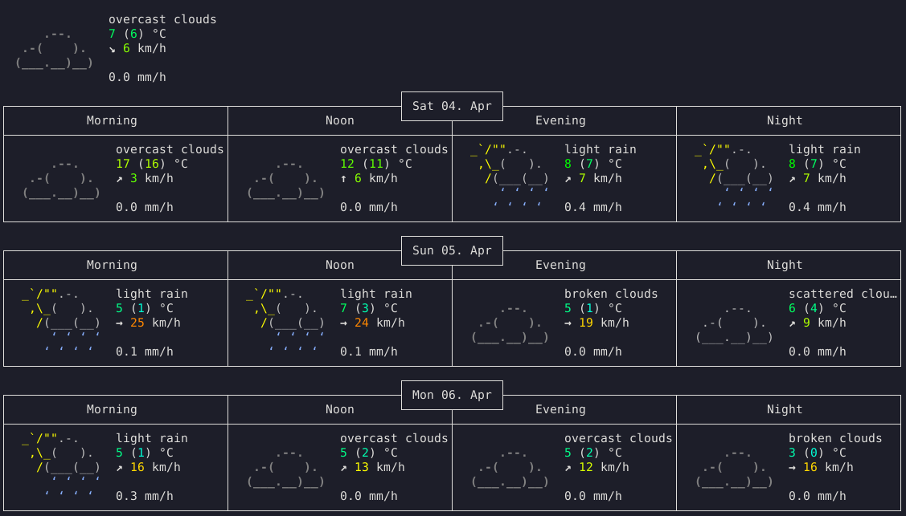

# How I Wrote a Distributed Cron in C with P2P Replication and Why Greenplum DBAs Need It

Imagine a classic sysadmin or SRE nightmare: it’s 3:00 AM, you’re managing a massive Greenplum cluster with a hundred segment hosts, and you need to run a heavy ETL process or check `gpfdist` availability strictly and simultaneously across all nodes.

You start going through your toolkit. Standard Cron? It’s local; syncing configs is a chore. Ansible or SaltStack? Great, but they require a central "master" and a stable SSH connection at the moment of execution. What if the network "flickers" in the data center and part of the segments become isolated? The command simply won’t arrive.

I decided the world needed a tool that acts like a **"smart mailbox"**: you drop an encrypted command into it, and it spreads across the entire network by itself, waiting for its moment to "fire" exactly on schedule. That is how **Gorgona** was born.

In this article, I will tell the thorny story of creating a distributed system in pure C, how I fought the "network echo," and why this solution lets big database admins sleep a little tighter.

---

Although I started with Greenplum, Gorgona’s architecture fits perfectly with any distributed system where the number of nodes exceeds dozens and the cost of a synchronization error grows exponentially.

#### 1. ClickHouse: Management Without ZooKeeper or ClickHouseKeeper "Brakes"
In ClickHouse, situations often arise where you need to perform DDL queries or maintenance on hundreds of shards. If ZooKeeper (the coordinator) is overloaded, standard `ON CLUSTER` mechanisms start to lag.
*   **Gorgona Case:** You deliver maintenance commands (e.g., `FREEZE PARTITION` for backup) through the Gorgona P2P network. Commands are executed locally on each node strictly at the appointed time without creating any load on the database coordinator.

#### 2. Ceph: Real-Time OSD Diagnostics
When a "storm" (rebalancing) starts in Ceph after disk failures, the load on the network and CPU skyrockets. Trying to break through via SSH to each of the 500 OSD nodes at that moment is a questionable pleasure.
*   **Gorgona Case:** Pre-deployed Gorgona agents allow you to "relay" a diagnostic command through the mesh network. Even if the direct channel to a node is clogged with Ceph replication traffic, the Gorgona packet will arrive via "detours" through neighbors, execute `smartctl` or `iostat`, and return the result.

#### 3. Apache Kafka: Bulk Configuration Changes for Brokers
Kafka brokers are highly sensitive to network delays. When updating filtering rules or quotas on the fly, it is vital that changes take effect as synchronously as possible to avoid skew in partitions.
*   **Gorgona Case:** We distribute new parameters through an encrypted channel. Nodes apply them autonomously. This eliminates the situation where half the brokers work under old rules and half under new ones because your Ansible script "hung" in the middle of the list.

---

### Why is this important for SRE and DevOps?

In large distributed systems, we fear two things: **Network Partitioning** and **Congestion**.

1.  **Breaching Isolation:** If part of the cluster "falls off" from the master management node but retains connection among itself, Gorgona’s P2P replication will still deliver the command. A neighbor will pass it to a neighbor.
2.  **Autonomy Against Congestion:** During peak loads, SSH sessions may drop due to timeouts. The Gorgona command already resides in the node's memory. It doesn't need a stable internet connection at the moment of start — it only needs the system clock.

---

> "Gorgona is not just for Greenplum. It is a universal transport layer for managing ClickHouse, Ceph, Elasticsearch, and any other 'monsters' of the distributed world. Where classic SSH fails due to network lag or coordinator overload, Gorgona works like an autonomous nervous system — quiet, fast, and fully encrypted."

---

## Why C and Why Such Complexity?

When starting a project of this level, there is always a temptation to use Go, Python, or Rust. But I had a fixed idea: **Zero Dependencies**. The tool must run on any "hardware," have a minimal memory footprint, and not pull megabytes of libraries with it. Only pure C and OpenSSL.

### The "Blind Server" Philosophy
The main intrigue of Gorgona is that the server is completely "dumb" and "blind." It operates on the principle of **End-to-End Encryption**.
1.  The client encrypts the command on its side (RSA-OAEP for keys + AES-GCM for data).
2.  The server receives a binary blob. It has no idea what is inside: an `rm -rf /` command or a weather report.
3.  The command is supplied with metadata: `unlock_at` (when to execute) and `expire_at` (when to delete).

The server honestly stores this "garbage" until `unlock_at` arrives, and only at that moment can a client with the private key retrieve and execute the command.

## The Path to a Mesh Network: An Engineering Drama in Three Acts

Initially, Gorgona was a classic client-server application. But for a Greenplum cluster, where there can be a hundred nodes or more, a single server is a "point of failure." If the server goes down, the cluster goes blind. I needed to implement replication.

### Act I: The Birth of the Gossip
I decided to implement **Active-Active replication** based on a Gossip protocol. The idea is simple: every server is both a client and a server simultaneously. As soon as one node receives a command from an admin, it immediately "runs" to tell all its neighbors (peers) about it.

### Act II: Infinite Echoes
And here is where I stepped on the classic rake of distributed systems. My servers turned out to be too "talkative."
*Server A* sends news to *Server B*. *Server B* receives it and, like a diligent gossip, sends it back to *Server A*. *Server A* receives it again...
Within a second, my logs turned into an infinite stream of identical messages, the CPU hit 100%, and the network was clogged with "noise." It was a perfect storm in a teacup.

### Act III: The "Stop-Tap" Rule
The solution came through implementing **idempotency**. I rewrote the message-saving logic so the server first checks: "Have I seen this packet before?"
Now the function returns different statuses:
*   **Status 0 (New):** "Oh, I haven't heard this one yet!" — save it and forward it to all neighbors.
*   **Status 1 (Duplicate):** "I already know this, be quiet" — ignore it and **stop forwarding**.

This simple rule instantly turned chaos into an ordered mesh network. A packet spreads through any complex topology (star, chain, web) and quiets down exactly at the moment all nodes have received their copy.

## How Not to Lose History: Snowflake and Mutual Sync

What if one of the segment servers was turned off for maintenance? While it was "asleep," three important commands flew into the network.

To allow nodes to "catch up" with each other, I used **Snowflake IDs** (kudos to Twitter). These are 64-bit identifiers that have the creation time encoded within them. They are unique and always move in ascending order.

Upon connection, nodes perform a "mutual recognition":
1.  **Node A:** "Hi, my last ID in the database is 162045..."
2.  **Node B:** "Oh, I have something newer!" — and it spits out the entire history the neighbor missed from its `mmap` buffer.

This is called **Mutual Sync**. Nodes don't need a central database like Postgres or Redis to reach an agreement. They do it themselves, on the fly.

## On the Frontline: Greenplum, ETL, and gpfdist

Let's get back to our Greenplum cluster. Why do DBAs love this solution so much?

В MPP systems, the main load (and the main problems) live on segment hosts.
**A typical scenario:** you need to run a `gpfdist` (data distribution service) check on all segments before a massive data load.

**How it works with Gorgona:**
1.  You run the client `gorgona listen -e` on every host.
2.  You send **one** command from your laptop to any nearby server.
3.  In milliseconds, the command "leaks" to all 50–100 servers.
4.  At the designated 03:00, all hosts simultaneously trigger the local check script.

**Security here is off the charts:** even if a hacker gains Root access to your replication server, they will only see encrypted chunks of data. They cannot spoof the command or read it because the private key resides only on the target segment hosts.

## A Bit of Levity: Encrypted Weather

The system turned out to be so flexible it can be used even for daily needs. For example, I set up a command to get the weather. It looks as "hacker-like" as it gets:

```bash
echo "weather 3 Moscow" | gorgona send "$(date -u '+%Y-%m-%d %H:%M:%S')" \
"$(date -u -d '+30 days' '+%Y-%m-%d %H:%M:%S')" - "RWTPQzuhzBw=.pub" && gorgona listen new
```

**In an instant, the response arrives back through the replication chain:**
```text
Received Alert: Recipient_Hash=RWTPQzuhzBw=
Alert ID: 162045830651904
Timestamps (Local): Created: 2026-04-04 00:26:10
Decrypted Content:
Weather for Moscow, RU

               overcast clouds
      .--.     7 (6) °C       
   .-(    ).   ↘ 6 km/h       
  (___.__)__)                 
               0.0 mm/h     
```

The public and private keys for this command can be found in the repository at [https://github.com/psqlmaster/gorgona](https://github.com/psqlmaster/gorgona).

Yes, it’s console-based, rugged, but it works through a distributed network without a single point of failure!

---

### Use Case Examples: From Monitoring to Cluster "Self-Healing"

#### 1. Instant Load Audit (Load Average)
A traditional example: getting the status of a specific node. Thanks to `mmap` and non-blocking I/O, the response arrives instantly as soon as the node sees the unlocked message.

```bash
# Send a request for Load Average and wait for the response
gorgona send "$(date -u '+%Y-%m-%d %H:%M:%S')" \
             "$(date -u -d '+30 days' '+%Y-%m-%d %H:%M:%S')" \
             "la" "BTW9V5jVztY=.pub" && gorgona listen new BTW9V5jVztY=

# Client output:
# Server response: Alert added successfully
# Server: Subscription updated
# Received Alert: Recipient_Hash=BTW9V5jVztY=
# Alert ID: 162195016097792
# Timestamps (Local): Created: 2026-04-04 10:33:12, Unlock: 2026-04-04 10:33:12
# Decrypted Content:
#  10:33:12 up 5 days, 9:41 LA=0.14, 0.11, 0.09 | CPU_USAGE:7.1% | CORES:16 | MEM:17Gi/124Gi
```

#### 2. Breaching Network Isolation (P2P Relay)
Suppose you have three network segments: `A`, `B`, and `C`. Your admin machine can only see segment `A`. Segment `A` nodes see `B`, and `B` nodes see `C`.

With SSH, you would have to build a chain of Jump hosts. In Gorgona, you just drop the packet into the nearest node:
```bash
# We send the packet to a node in segment A, and it "gossips" it to segments B and C
echo "check_status" | gorgona send "$(date -u '+%Y-%m-%d %H:%M:%S')" "$(date -u -d '+30 days' '+%Y-%m-%d %H:%M:%S')" - "segments_all.pub"
```
Replication will find its own path to the target hosts in the mesh network. This makes infrastructure management resilient to complex topologies and temporary connectivity losses.

#### 3. Synchronous "Shot" Without Jitter
Even with `xargs -P100 ssh`, the command start time on the 1st and 100th node will differ due to TCP connection setup and Handshake time. For precise performance tests, this is critical.

In Gorgona, you distribute the packet in advance (say, 10 minutes prior):
```bash
# The command is already sitting in the memory of all nodes, waiting for 15:00:00 UTC
gorgona send "2026-04-04 15:00:00" "2026-04-04 15:01:00" "run_heavy_etl_test" "db_nodes.pub"
```
Exactly at `15:00:00.000`, all 100 servers will **simultaneously** begin execution. This is true atomicity in a distributed system.

## What's Under the Hood? (For those who like it hot)

*   **Network Engine:** Single-threaded `select()` with non-blocking sockets. Why not `epoll`? For 100–200 connections in a cluster, `select()` is easier to debug and more portable.
*   **Storage:** `mmap()` files. The database in memory is a ring buffer that the Linux kernel itself flushes to disk. Access speed is astronomical.
*   **Anti-Replay:** Dual-layer protection. We cut off packets that have "expired" (`unlock_at` too far in the past) and maintain a sliding window of hashes of the last 50 messages so no one can send the same command twice.

## Results and Plans

Gorgona has transformed from a small experiment into a full-fledged P2P engine for infrastructure management. It allows for building autonomous systems that don't need a "Big Brother" in the form of a central database.

**In the near future:**
*   **epoll:** If you suddenly want to build a cluster of 10,000 nodes.
*   **Web Dashboard:** To see the "gossip map" in real-time.

The project is completely open-source. If you are into system programming in C, check out GitHub. Stars, forks, and discussions of new use cases are more than welcome!

[Link to GitHub: https://github.com/psqlmaster/gorgona]
